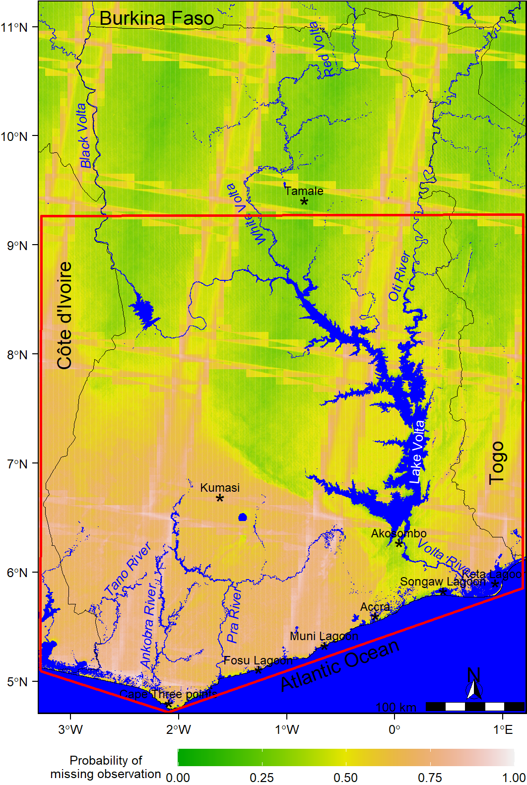
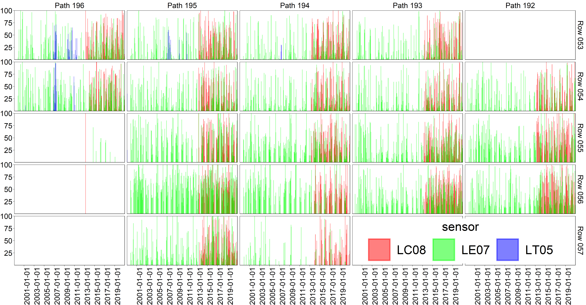
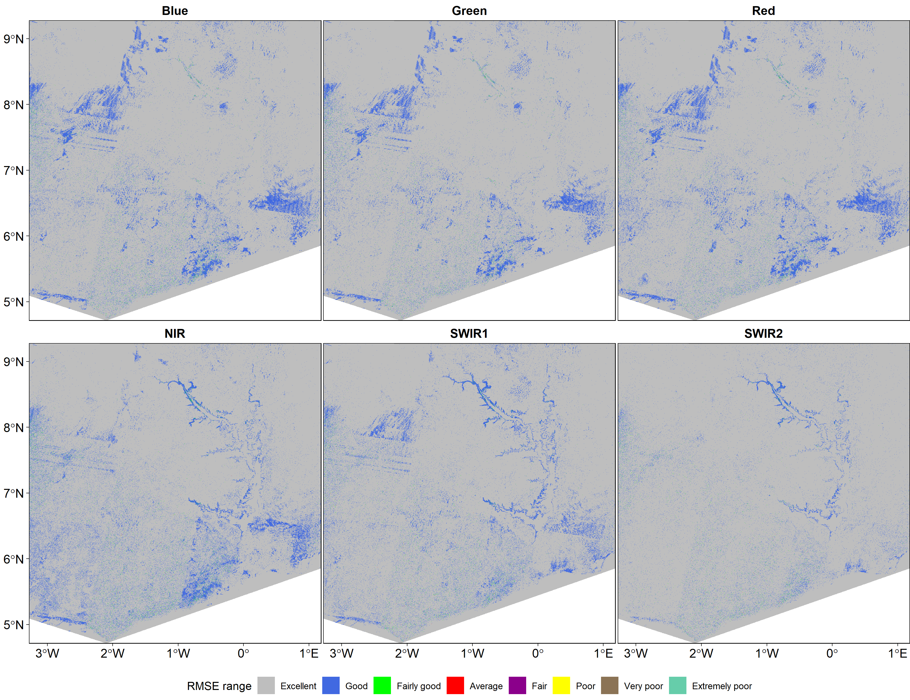
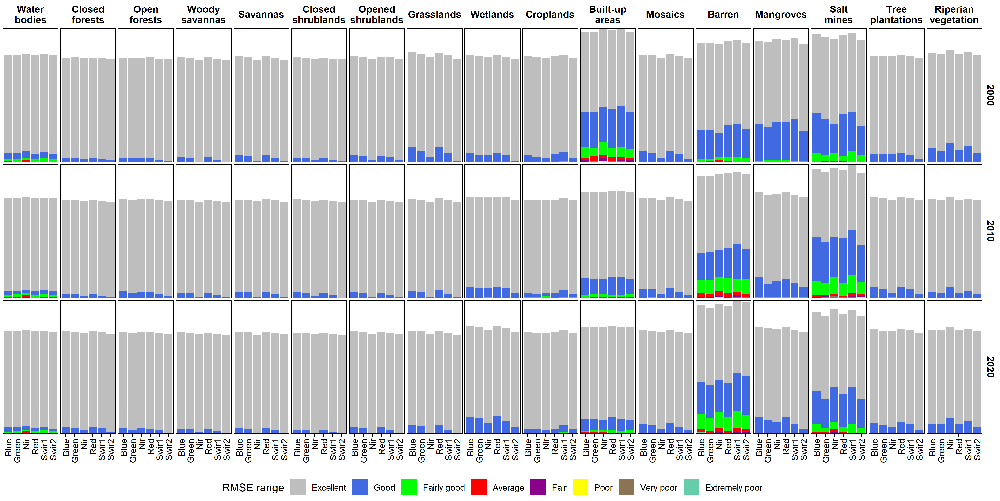
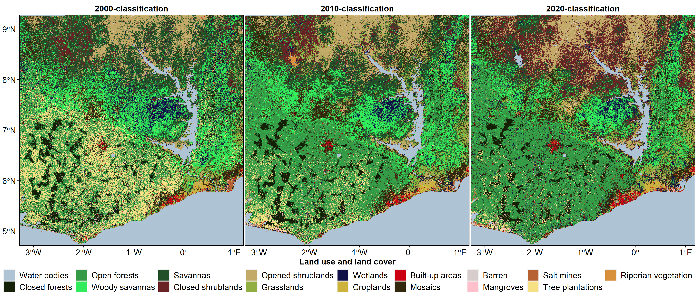

```{r,include=FALSE}
options(tinytex.engine='xelatex')
pdf.options(useDingbats = TRUE)
```

```{r setup,include=FALSE}
knitr::opts_chunk$set(echo=TRUE,out.extra='',fig.align='center',fig.pos='!htbp',cache=TRUE,echo=FALSE,warning=FALSE,message=FALSE)
```

```{r Setting-the-Scene, echo=FALSE, cache=FALSE, include=FALSE}
set.seed(123)

if (!require("remotes")) {
  install.packages("remotes")
}
if (!require("rgee")) {
  remotes::install_github("r-spatial/rgee")
}
if(!require("tinytex")) {
  install.packages("tinytex")
  tinytex::install_tinytex()
}
## loading required packages ####
if (!require("pacman")) install.packages("pacman")
pacman::p_load(
  googledrive,
  googleCloudStorageR,
  rgee,
  tidyverse,
  grid,
  gridExtra,
  tiff,
  rgdal,
  raster,
  sf,
  ggspatial,
  kableExtra
)
if (!require("gdalUtils")) install.packages("gdalUtils")

ksource <- function(x, ...) {
  source(purl(x, output = tempfile()), ...)
}

## Should local files with the same name be overwritten?
overwrite_file = FALSE

ee_Initialize(drive = TRUE, gcs = FALSE)
# ee_Initialize(email = params$email, drive = params$drive, gcs = params$gcs)

asset_home = ee_get_assethome()

source('source_files/ee/01_functions.R')

if(!drive_folder_exists("Mangrove_Ghana_manuscript")){
  drive_mkdir("Mangrove_Ghana_manuscript")
}
ee_manage_create(paste0(asset_home, '/Mangrove_Ghana_manuscript'), asset_type = "Folder", quiet = FALSE)


asset_path <- paste0(asset_home, '/Mangrove_Ghana_manuscript')

dir.create(file.path('source_files'))
dir.create(file.path('source_files/ee'))
dir.create(file.path('source_files/r'))
dir.create(file.path('ee_output'))
dir.create(file.path('ee_output/Ghana_waters_polygons'))
dir.create(file.path('data_files'))
dir.create(file.path('figures'))
dir.create(file.path('figures/tifs'))
dir.create(file.path('figures/pngs'))

source('source_files/ee/02_commonSpecs.R')
map(list('.shp', '.shx', 'prj', 'dbf', 'cpg'), function(i){
  ee_to_drive_to_local (
    ee_object = ee$FeatureCollection(list(ee$Feature(roiGhana))),
    drive_description = '~/Mangrove_Ghana_manuscript/roiGhana', 
    drive_folder = 'Mangrove_Ghana_manuscript', 
    region = roiGhana, 
    scale = AgScale,
    maxPixels = 1e13, 
    local_folder  = 'ee_output/roiGhana',
    overwrite = overwrite_file,
    ee_type = 'table',
    file_extension = i
  )
})
```

```{r ee-compute-02-referenceData,include=FALSE,echo=FALSE,cache=FALSE}
assetId <- paste0(asset_path, "/Ghana_field_data")
if(!asset_exists("Ghana_field_data", asset_path)){
  source("source_files/ee/03_referenceData.R")
  
  ## Unsupervised class identification and matching
  
  # The following images are made available only. This is for 2 raisins:
  # To ensure reproducibility
  # They are time consuming in computation
  unsupervised_2000 = ee$Image('users/Liman/210311_unsupervised2000_Ghana');
  unsupervised_2010 = ee$Image('users/Liman/210311_unsupervised2010_Ghana');
  unsupervised_2018 = ee$Image('users/Liman/210311_unsupervised2018_Ghana');
  numPoints = 700
  # Class identification and matching
  past = 11; p10 = 11; przt = 11;
  matches = unsupervised_2000$eq(past)$And(unsupervised_2010$eq(p10))$And(unsupervised_2018$eq(przt))$rename('matches')
  
  waterBodies = matches$
    stratifiedSample(
      numPoints = 250, 
      region = waterZone, 
      scale = AgScale, 
      classValues = list(0), 
      classPoints = list(0),
      tileScale = 4, 
      geometries = TRUE
    )$map(ee_utils_pyfunc(function(ft){
      return (
        ft$set('class', 'Fresh water')$
          set('matches', NULL)$
          set('past', past)$
          set('p10', p10)$
          set('present', przt)$
          set('landcover', 0)
      );
    }));
 
  past = 11; p10 = 11; przt = 11;
  matches = unsupervised_2000$eq(past)$And(unsupervised_2010$eq(p10))$And(unsupervised_2018$eq(przt))$rename('matches')
  
  waterBodies_2 = matches$
    stratifiedSample(
      numPoints = 100, 
      region = waterZone_2, 
      scale = AgScale, 
      classValues = list(0), 
      classPoints = list(0),
      tileScale = 4, 
      geometries = TRUE
    )$map(ee_utils_pyfunc(function(ft){
      return (
        ft$set('class', 'Fresh water')$
          set('matches', NULL)$
          set('past', past)$
          set('p10', p10)$
          set('present', przt)$
          set('landcover', 0)
      );
    }));

  past = 11; p10 = 11; przt = 11;
  matches = unsupervised_2000$eq(past)$And(unsupervised_2010$eq(p10))$And(unsupervised_2018$eq(przt))$rename('matches')
  
  seaWater_1 = matches$
    stratifiedSample(
      numPoints = numPoints*4/8, 
      region = seaWaterZone_1$merge(seaWaterZone_2), 
      scale = AgScale, 
      classValues = list(0), 
      classPoints = list(0),
      
      tileScale = 4, 
      geometries = TRUE
    )$map(ee_utils_pyfunc(function(ft){
      return (
        ft$set('class', 'Non-fresh water')$
          set('matches', NULL)$
          set('past', past)$
          set('p10', p10)$
          set('present', przt)$
          set('landcover', 0)
      );
    }));
  
  past = 9; p10 = 10; przt = 9;
  matches = unsupervised_2000$eq(past)$And(unsupervised_2010$eq(p10))$And(unsupervised_2018$eq(przt))$rename('matches')
  closeForests_1 = matches$
    stratifiedSample(
      numPoints = numPoints, 
      region = closeForestZone_1$merge(closeForestZone_2), 
      scale = AgScale, 
      classValues = list(0), 
      classPoints = list(0),
      
      tileScale = 4, 
      geometries = TRUE
    )$map(ee_utils_pyfunc(function(ft){
      return (
        ft$set('class', 'Close forests')$
          set('matches', NULL)$
          set('past', past)$
          set('p10', p10)$
          set('present', przt)$
          set('landcover', 1)
      );
    }));
  
  past = 0; p10 = 0; przt = 0;
  matches = unsupervised_2000$eq(past)$And(unsupervised_2010$eq(p10))$And(unsupervised_2018$eq(przt))$rename('matches')

  openForests_1 = matches$
    stratifiedSample(
      numPoints = numPoints*2/5, 
      region = openForestZone_1, 
      scale = AgScale, 
      classValues = list(0), 
      classPoints = list(0),
      
      tileScale = 4, 
      geometries = TRUE
    )$map(ee_utils_pyfunc(function(ft){
      return (
        ft$set('class', 'Open forests')$
          set('matches', NULL)$
          set('past', past)$
          set('p10', p10)$
          set('present', przt)$
          set('landcover', 2)
      );
    }));
  
  openForests_2 = matches$
    stratifiedSample(
      numPoints = numPoints*2/5, 
      region = openForestZone_2, 
      scale = AgScale, 
      classValues = list(0), 
      classPoints = list(0),
      
      tileScale = 4, 
      geometries = TRUE
    )$map(ee_utils_pyfunc(function(ft){
      return (
        ft$set('class', 'Open forests')$
          set('matches', NULL)$
          set('past', past)$
          set('p10', p10)$
          set('present', przt)$
          set('landcover', 2)
      );
    }));
  
  openForests_3 = matches$
    stratifiedSample(
      numPoints = numPoints*1/5, 
      region = openForestZone_3, 
      scale = AgScale, 
      classValues = list(0), 
      classPoints = list(0),
      
      tileScale = 4, 
      geometries = TRUE
    )$map(ee_utils_pyfunc(function(ft){
      return (
        ft$set('class', 'Open forests')$
          set('matches', NULL)$
          set('past', past)$
          set('p10', p10)$
          set('present', przt)$
          set('landcover', 2)
      );
    }));
 
  past = 6; p10 = 6; przt = 15;
  matches = unsupervised_2000$eq(past)$And(unsupervised_2010$eq(p10))$And(unsupervised_2018$eq(przt))$rename('matches')
  
  woodySavannas_1 = matches$
    stratifiedSample(
      numPoints = numPoints, 
      region = woodySavannaZone_1$merge(woodySavannaZone_2), 
      scale = AgScale, 
      classValues = list(0), 
      classPoints = list(0),
      
      tileScale = 4, 
      geometries = TRUE
    )$map(ee_utils_pyfunc(function(ft){
      return (
        ft$set('class', 'Woody savannas')$
          set('matches', NULL)$
          set('past', past)$
          set('p10', p10)$
          set('present', przt)$
          set('landcover', 3)
      );
    }));
  
  past = 3; p10 = 2; przt = 16;
  matches = unsupervised_2000$eq(past)$And(unsupervised_2010$eq(p10))$And(unsupervised_2018$eq(przt))$rename('matches');
  
  savannas_1 = matches$
    stratifiedSample(
      numPoints = numPoints, 
      region = savannaZone_1$merge(savannaZone_2), 
      scale = AgScale, 
      classValues = list(0), 
      classPoints = list(0),
      
      tileScale = 4, 
      geometries = TRUE
    )$map(ee_utils_pyfunc(function(ft){
      return (
        ft$set('class', 'Savannas')$
          set('matches', NULL)$
          set('past', past)$
          set('p10', p10)$
          set('present', przt)$
          set('landcover', 4)
      );
    }));
  
  past = 2; p10 = 2; przt = 2;
  matches = unsupervised_2000$eq(past)$And(unsupervised_2010$eq(p10))$And(unsupervised_2018$eq(przt))$rename('matches');
  closedShrubs_1 = matches$
    stratifiedSample(
      numPoints = numPoints, 
      region = closedShrubsZone_1$merge(closedShrubsZone_2)$merge(closedShrubsZone_3), 
      scale = AgScale, 
      classValues = list(0), 
      classPoints = list(0),
      
      tileScale = 4, 
      geometries = TRUE
    )$map(ee_utils_pyfunc(function(ft){
      return (
        ft$set('class', 'Close shrublands')$
          set('matches', NULL)$
          set('past', past)$
          set('p10', p10)$
          set('present', przt)$
          set('landcover', 5)
      );
    }));
  
  past = 5; p10 = 5; przt = 1;
  matches = unsupervised_2000$eq(past)$And(unsupervised_2010$eq(p10))$And(unsupervised_2018$eq(przt))$rename('matches');
  openShrubs_1 = matches$
    stratifiedSample(
      numPoints = numPoints, 
      region = openShrubsZone_1$merge(openShrubsZone_2)$merge(openShrubsZone_3), 
      scale = AgScale, 
      classValues = list(0), 
      classPoints = list(0),
      
      tileScale = 4, 
      geometries = TRUE
    )$map(ee_utils_pyfunc(function(ft){
      return (
        ft$set('class', 'Open Shrublands')$
          set('matches', NULL)$
          set('past', past)$
          set('p10', p10)$
          set('present', przt)$
          set('landcover', 6)
      );
    }));
  
  past = 16; p10 = 16; przt = 2;
  matches = unsupervised_2000$eq(past)$And(unsupervised_2010$eq(p10))$And(unsupervised_2018$eq(przt))$rename('matches');
  grasslands_1 = matches$
    stratifiedSample(
      numPoints = numPoints, 
      region = grasslandZone_1$merge(grasslandZone_2), 
      scale = AgScale, 
      classValues = list(0), 
      classPoints = list(0),
      
      tileScale = 4, 
      geometries = TRUE
    )$map(ee_utils_pyfunc(function(ft){
      return (
        ft$set('class', 'Grasslands')$
          set('matches', NULL)$
          set('past', past)$
          set('p10', p10)$
          set('present', przt)$
          set('landcover', 7)
      );
    }));
  
    past = 2; p10 = 6; przt = 15;
  matches = unsupervised_2000$eq(past)$And(unsupervised_2010$eq(p10))$And(unsupervised_2018$eq(przt))$rename('matches');
  wetlands_1 = matches$
    stratifiedSample(
      numPoints = numPoints*1/5, 
      region = wetlandsZone_1,
      scale = AgScale, 
      classValues = list(0), 
      classPoints = list(0),
      
      tileScale = 4, 
      geometries = TRUE
    )$map(ee_utils_pyfunc(function(ft){
      return (
        ft$set('class', 'Wetlands')$
          set('matches', NULL)$
          set('past', past)$
          set('p10', p10)$
          set('present', przt)$
          set('landcover', 8)
      );
    }));
  
  wetlands_2 = matches$
    stratifiedSample(
      numPoints = numPoints*2/5, 
      region = wetlandsZone_2$merge(wetlandsZone_3), 
      scale = AgScale, 
      classValues = list(0), 
      classPoints = list(0),
      
      tileScale = 4, 
      geometries = TRUE
    )$map(ee_utils_pyfunc(function(ft){
      return (
        ft$set('class', 'Wetlands')$
          set('matches', NULL)$
          set('past', past)$
          set('p10', p10)$
          set('present', przt)$
          set('landcover', 8)
      );
    }));
  
  wetlands_3 = matches$
    stratifiedSample(
      numPoints = numPoints*2/5, 
      region = wetlandsZone_3, 
      scale = AgScale, 
      classValues = list(0), 
      classPoints = list(0),
      
      tileScale = 4, 
      geometries = TRUE
    )$map(ee_utils_pyfunc(function(ft){
      return (
        ft$set('class', 'Wetlands')$
          set('matches', NULL)$
          set('past', past)$
          set('p10', p10)$
          set('present', przt)$
          set('landcover', 8)
      );
    }));
  
  past = 8; p10 = 8; przt = 8;
  matches = unsupervised_2000$eq(past)$And(unsupervised_2010$eq(p10))$And(unsupervised_2018$eq(przt))$rename('matches');
  mosaic_1 = matches$
    stratifiedSample(
      numPoints = numPoints, 
      region = mosaicZone_1$merge(mosaicZone_2)$merge(mosaicZone_3), 
      scale = AgScale, 
      classValues = list(0), 
      classPoints = list(0),
      
      tileScale = 4, 
      geometries = TRUE
    )$map(ee_utils_pyfunc(function(ft){
      return (
        ft$set('class', 'Croplands')$
          set('matches', NULL)$
          set('past', past)$
          set('p10', p10)$
          set('present', przt)$
          set('landcover', 9)
      );
    }));
  
  past = 8; p10 = 8; przt = 8;
  matches = unsupervised_2000$eq(past)$And(unsupervised_2010$eq(p10))$And(unsupervised_2018$eq(przt))$rename('matches');
  builtUp_1 = matches$
    stratifiedSample(
      numPoints = numPoints*3/5, 
      region = builtUpZone_1, 
      scale = AgScale, 
      classValues = list(0), 
      classPoints = list(0),
      
      tileScale = 4, 
      geometries = TRUE
    )$map(ee_utils_pyfunc(function(ft){
      return (
        ft$set('class', 'Built-up')$
          set('matches', NULL)$
          set('past', past)$
          set('p10', p10)$
          set('present', przt)$
          set('landcover', 10)
      );
    }));
  
  builtUp_2 = matches$
    stratifiedSample(
      numPoints = numPoints*2/5, 
      region = builtUpZone_2, 
      scale = AgScale, 
      classValues = list(0), 
      classPoints = list(0),
      
      tileScale = 4, 
      geometries = TRUE
    )$map(ee_utils_pyfunc(function(ft){
      return (
        ft$set('class', 'Built-up')$
          set('matches', NULL)$
          set('past', past)$
          set('p10', p10)$
          set('present', przt)$
          set('landcover', 10)
      );
    }));
  
  past = 5; p10 = 1; przt = 5;
  matches = unsupervised_2000$eq(past)$And(unsupervised_2010$eq(p10))$And(unsupervised_2018$eq(przt))$rename('matches');
  croplandBimodal_1 = matches$
    stratifiedSample(
      numPoints = numPoints*2.5/5, 
      region = croplandBimodalZone_1$merge(croplandBimodalZone_2)$merge(croplandBimodalZone_3)$merge(croplandBimodalZone_4)$merge(croplandBimodalZone_5), 
      scale = AgScale, 
      classValues = list(0), 
      classPoints = list(0),
      tileScale = 4, 
      geometries = TRUE
    )$map(ee_utils_pyfunc(function(ft){
      return (
        ft$set('class', 'Mosaic')$
          set('matches', NULL)$
          set('past', past)$
          set('p10', p10)$
          set('present', przt)$
          set('landcover', 11)
      );
    }));
  
  past = 16; p10 = 16; przt = 5;
  matches = unsupervised_2000$eq(past)$And(unsupervised_2010$eq(p10))$And(unsupervised_2018$eq(przt))$rename('matches');
  croplandUnimodal_1 = matches$
    stratifiedSample(
      numPoints = numPoints*2.5/5, 
      region = croplandUnimodalZone_1$merge(croplandUnimodalZone_2), 
      scale = AgScale, 
      classValues = list(0), 
      classPoints = list(0),
      
      tileScale = 4, 
      geometries = TRUE
    )$map(ee_utils_pyfunc(function(ft){
      return (
        ft$set('class', 'Mosaic')$
          set('matches', NULL)$
          set('past', past)$
          set('p10', p10)$
          set('present', przt)$
          set('landcover', 11)
      );
    }));
  
  past = 8; p10 = 8; przt = 8;
  matches = unsupervised_2000$eq(past)$And(unsupervised_2010$eq(p10))$And(unsupervised_2018$eq(przt))$rename('matches');
  barren = matches$
    stratifiedSample(
      numPoints = numPoints, 
      region = barrenZone_1, 
      scale = AgScale, 
      classValues = list(0), 
      classPoints = list(0),
      
      tileScale = 4, 
      geometries = TRUE
    )$map(ee_utils_pyfunc(function(ft){
      return (
        ft$set('class', 'Barren')$
          set('matches', NULL)$
          set('past', past)$
          set('p10', p10)$
          set('present', przt)$
          set('landcover', 12)
      );
    }));
  
  past = 9; p10 = 10; przt = 9;
  matches = unsupervised_2000$eq(past)$And(unsupervised_2010$eq(p10))$And(unsupervised_2018$eq(przt))$rename('matches');
  mangroves = matches$
    stratifiedSample(
      numPoints = numPoints, 
      region = mangroveZone_7$merge(mangroveZone_8)$merge(mangroveZone_9)$merge(mangroveZone_10)$merge(mangroveZone_11), 
      scale = AgScale, 
      classValues = list(0), 
      classPoints = list(0),
      
      tileScale = 4, 
      geometries = TRUE
    )$map(ee_utils_pyfunc(function(ft){
      return (
        ft$set('class', 'Mangroves')$
          set('matches', NULL)$
          set('past', past)$
          set('p10', p10)$
          set('present', przt)$
          set('landcover', 13)
      );
    }));
  
  past = 11; p10 = 11; przt = 11;
  matches = unsupervised_2000$eq(past)$And(unsupervised_2010$eq(p10))$And(unsupervised_2018$eq(przt))$rename('matches');
  saltMines = matches$
    stratifiedSample(
      numPoints = numPoints, 
      region = saltMineZone_1, 
      scale = AgScale, 
      classValues = list(0), 
      classPoints = list(0),
      
      tileScale = 4, 
      geometries = TRUE
    )$map(ee_utils_pyfunc(function(ft){
      return (
        ft$set('class', 'Salt mines')$
          set('matches', NULL)$
          set('past', past)$
          set('p10', p10)$
          set('present', przt)$
          set('landcover', 14)
      );
    }));
  
  past = 7; p10 = 0; przt = 9;
  matches = unsupervised_2000$eq(past)$And(unsupervised_2010$eq(p10))$And(unsupervised_2018$eq(przt))$rename('matches');
  palmTrees = matches$
    stratifiedSample(
      numPoints = numPoints, 
      region = palmTreesZone, 
      scale = AgScale, 
      classValues = list(0), 
      classPoints = list(0),
      
      tileScale = 4, 
      geometries = TRUE
    )$map(ee_utils_pyfunc(function(ft){
      return (
        ft$set('class', 'Croplands trees')$
          set('matches', NULL)$
          set('past', past)$
          set('p10', p10)$
          set('present', przt)$
          set('landcover', 15)
      );
    }));
  
  past = 9; p10 = 12; przt = 9;
  matches = unsupervised_2000$eq(past)$And(unsupervised_2010$eq(p10))$And(unsupervised_2018$eq(przt))$rename('matches');
  riperianVegetation = matches$
    stratifiedSample(
      numPoints = numPoints, 
      region = waterZone_2, 
      scale = AgScale, 
      classValues = list(0), 
      classPoints = list(0),
      
      tileScale = 4, 
      geometries = TRUE
    )$map(ee_utils_pyfunc(function(ft){
      return (
        ft$set('class', 'Riperian vegetation')$
          set('matches', NULL)$
          set('past', past)$
          set('p10', p10)$
          set('present', przt)$
          set('landcover', 16)
      );
    }));
  
  Ghana_field_data = waterBodies$
    merge(seaWater_1)$
    merge(waterBodies_2)$
    merge(closeForests_1)$
    merge(openForests_1)$
    merge(openForests_2)$
    merge(openForests_3)$
    merge(woodySavannas_1)$
    merge(savannas_1)$
    merge(closedShrubs_1)$
    merge(openShrubs_1)$
    merge(grasslands_1)$
    merge(wetlands_1)$
    merge(wetlands_2)$
    merge(wetlands_3)$
    merge(croplandBimodal_1)$
    merge(builtUp_1)$
    merge(builtUp_2)$
    merge(mosaic_1)$
    merge(barren)$
    merge(saltMines)$
    merge(mangroves)$
    merge(croplandUnimodal_1)$
    merge(palmTrees)$
    merge(riperianVegetation);
  
  task_vector = ee_table_to_asset(
    collection = Ghana_field_data,
    description = "Ghana_field_data",
    assetId = assetId,
    overwrite = FALSE
  )
  
  task_vector$start()
  ee_task_monitoring(task_vector) 
}
```

```{r ee-compute-03-training-and-validation-1,include=FALSE,echo=FALSE,cache=FALSE}
# Compute and save the training and validation samples to ee asset 

Ghana_field_data = ee$FeatureCollection(paste0(asset_path, '/Ghana_field_data'));
Ghana_field_data = Ghana_field_data$randomColumn();
split = 0.3;  # Roughly 30% training, 70% testing.
validation = Ghana_field_data$filter(ee$Filter$gte('random', split));
training = Ghana_field_data$filter(ee$Filter$lt('random', split));

# Collection 1999 - 2020 

filteredLandsat =  collectLansatImages ('LSR', roiGhana, 1999, 2020, ee$List$sequence(1, 12), nDays, TRUE);
filteredLandsat = ee$ImageCollection(filteredLandsat);

# Some fixed variable for easy maintenance
rawBands = ee$List(list('blue', 'green', 'red', 'nir', 'swir1', 'swir2', 'temp', 'NDVI', 'NDWI'));

filledHarmonic = harmonic_fill(filteredLandsat, rawBands, harmonics);

fitBands = ee$List(list('blue', 'green', 'red', 'nir', 'swir1', 'swir2'))$
  map(ee_utils_pyfunc(function(band){
    return (ee$String(band)$cat('_')$cat('filled'));
  }));

fittedHarmonic = harmonic_fit(filledHarmonic, fitBands, harmonics, lagDays);


# Unsupervised classification 2000 - 2002

classificationBands = ee$List(list('blue', 'green', 'red', 'nir', 'swir1', 'swir2'))$
  map(ee_utils_pyfunc(function(band){
    return (ee$String(band)$cat('_')$cat('filled')$cat('_')$cat('fitted'));
  }));
fittedHarmonic_2000 = fittedHarmonic$select(classificationBands)$
  filterDate('2000-01-01', '2002-12-31');

bandSeries_2000 = fittedHarmonic_2000$toBands();

# Unsupervised classification 2010 - 2012

fittedHarmonic_2010 = fittedHarmonic$select(classificationBands)$
  filterDate('2010-01-01', '2012-12-31');

bandSeries_2010 = fittedHarmonic_2010$toBands();

# Unsupervised classification 2018 - 2020

fittedHarmonic_2018 = fittedHarmonic$select(classificationBands)$
  filterDate('2018-01-01', '2020-12-31');

bandSeries_2018 = fittedHarmonic_2018$toBands();

training_2018 = bandSeries_2018$sampleRegions(
  collection =  training,
  properties =  list('landcover'),
  scale =  AgScale,
  geometries =  TRUE,
  tileScale =  10
);

assetId <- paste0(asset_path, "/training_2018")
if(!asset_exists("training_2018", asset_path)){
  task_vector = ee_table_to_asset(
    collection = training_2018,
    description = "training_2018",
    assetId = assetId,
    overwrite = FALSE
  )
  
  task_vector$start()
  ee_task_monitoring(task_vector)
}

validation_2018 = bandSeries_2018$sampleRegions(
  collection =  validation,
  properties =  list('landcover'),
  scale =  AgScale,
  geometries =  TRUE,
  tileScale =  10
);

assetId <- paste0(asset_path, "/validation_2018")
if(!asset_exists("validation_2018", asset_path)){
  task_vector = ee_table_to_asset(
    collection = validation_2018,
    description = "validation_2018",
    assetId = assetId,
    overwrite = FALSE
  )
  
  task_vector$start()
  ee_task_monitoring(task_vector)
}

training_2010 = bandSeries_2010$sampleRegions(
  collection =  training,
  properties =  list('landcover'),
  scale =  AgScale,
  geometries =  TRUE,
  tileScale =  10
);

assetId <- paste0(asset_path, "/training_2010")
if(!asset_exists("training_2010", asset_path)){
  task_vector = ee_table_to_asset(
    collection = training_2010,
    description = "training_2010",
    assetId = assetId,
    overwrite = FALSE
  )
  
  task_vector$start()
  ee_task_monitoring(task_vector)
}

validation_2010 = bandSeries_2010$sampleRegions(
  collection =  validation,
  properties =  list('landcover'),
  scale =  AgScale,
  geometries =  TRUE,
  tileScale =  10
);

assetId <- paste0(asset_path, "/validation_2010")
if(!asset_exists("validation_2010", asset_path)){
  task_vector = ee_table_to_asset(
    collection = validation_2010,
    description = "validation_2010",
    assetId = assetId,
    overwrite = FALSE
  )
  
  task_vector$start()
  ee_task_monitoring(task_vector)
}

training_2000 = bandSeries_2000$sampleRegions(
  collection =  training,
  properties =  list('landcover'),
  scale =  AgScale,
  geometries =  TRUE,
  tileScale =  10
);

assetId <- paste0(asset_path, "/training_2000")
if(!asset_exists("training_2000", asset_path)){
  task_vector = ee_table_to_asset(
    collection = training_2000,
    description = "training_2000",
    assetId = assetId,
    overwrite = FALSE
  )
  
  task_vector$start()
  ee_task_monitoring(task_vector)
}

validation_2000 = bandSeries_2000$sampleRegions(
  collection =  validation,
  properties =  list('landcover'),
  scale =  AgScale,
  geometries =  TRUE,
  tileScale =  10
);

assetId <- paste0(asset_path, "/validation_2000")
if(!asset_exists("validation_2000", asset_path)){
  task_vector = ee_table_to_asset(
    collection = validation_2000,
    description = "validation_2000",
    assetId = assetId,
    overwrite = FALSE
  )
  
  task_vector$start()
  ee_task_monitoring(task_vector)
}
```

```{r ee-compute-03-training-and-validation-2,include=FALSE,echo=FALSE,cache=FALSE}

##################/ Collection 1999 - 2020  ###################

filteredLandsat =  collectLansatImages ('LSR', roiGhana, 1999, 2020, ee$List$sequence(1, 12), nDays, TRUE);
filteredLandsat = ee$ImageCollection(filteredLandsat);

# Some fixed variable for easy maintenance
rawBands = ee$List(list('blue', 'green', 'red', 'nir', 'swir1', 'swir2', 'temp', 'NDVI', 'NDWI'));

filledHarmonic = harmonic_fill(filteredLandsat, rawBands, harmonics);

fitBands = ee$List(list('blue', 'green', 'red', 'nir', 'swir1', 'swir2'))$
  map(ee_utils_pyfunc(function(band){
    return (ee$String(band)$cat('_')$cat('filled'));
  }));

fittedHarmonic = harmonic_fit(filledHarmonic, fitBands, harmonics, lagDays);

# 2000 - 2002

classificationBands = ee$List(list('blue', 'green', 'red', 'nir', 'swir1', 'swir2'))$
  map(ee_utils_pyfunc(function(band){
    return (ee$String(band)$cat('_')$cat('filled')$cat('_')$cat('fitted'));
  }));
fittedHarmonic_2000 = fittedHarmonic$select(classificationBands)$
  filterDate('2000-01-01', '2002-12-31');

bandSeries_2000 = fittedHarmonic_2000$toBands();

# 2010 - 2012

fittedHarmonic_2010 = fittedHarmonic$select(classificationBands)$
  filterDate('2010-01-01', '2012-12-31');

bandSeries_2010 = fittedHarmonic_2010$toBands();

# 2018 - 2020

fittedHarmonic_2018 = fittedHarmonic$select(classificationBands)$
  filterDate('2018-01-01', '2020-12-31');
bandSeries_2018 = fittedHarmonic_2018$toBands();

training_2018 = ee$FeatureCollection(paste0(asset_path, '/training_2018'));
training_2010 = ee$FeatureCollection(paste0(asset_path, '/training_2010'));
training_2000 = ee$FeatureCollection(paste0(asset_path, '/training_2000'));

validation_2018 = ee$FeatureCollection(paste0(asset_path, '/validation_2018'));
validation_2010 = ee$FeatureCollection(paste0(asset_path, '/validation_2010'));
validation_2000 = ee$FeatureCollection(paste0(asset_path, '/validation_2000'));

validatedModel_2018 = validateClassification (bandSeries_2018, training_2018, validation_2018, 'landcover', 'classification', 100);
validatedModel_2010 = validateClassification (bandSeries_2010, training_2010, validation_2010, 'landcover', 'classification', 100);
validatedModel_2000 = validateClassification (bandSeries_2000, training_2000, validation_2000, 'landcover', 'classification', 100)

ee_to_drive_to_local (
  ee_object = getAccuracyElement(validatedModel_2018),
  drive_description = '~/Mangrove_Ghana_manuscript/Ghana_validatedModel_2018', 
  drive_folder = 'Mangrove_Ghana_manuscript', 
  local_folder = 'ee_output',
  overwrite = overwrite_file,
  ee_type = 'table',
  file_extension = '.csv'
)
ee_to_drive_to_local (
  ee_object = getAccuracyElement(validatedModel_2010),
  drive_description = '~/Mangrove_Ghana_manuscript/Ghana_validatedModel_2010', 
  drive_folder = 'Mangrove_Ghana_manuscript', 
  local_folder = 'ee_output',
  overwrite = overwrite_file,
  ee_type = 'table',
  file_extension = '.csv'
)
ee_to_drive_to_local (
  ee_object = getAccuracyElement(validatedModel_2000),
  drive_description = '~/Mangrove_Ghana_manuscript/Ghana_validatedModel_2000', 
  drive_folder = 'Mangrove_Ghana_manuscript', 
  local_folder = 'ee_output',
  overwrite = overwrite_file,
  ee_type = 'table',
  file_extension = '.csv'
)
```

```{r ee-compute-04-supervised-classifications-01,include=FALSE,echo=FALSE,cache=FALSE}

filteredLandsat =  collectLansatImages ('LSR', roiGhana, 1999, 2020, ee$List$sequence(1, 12), nDays,  TRUE);
filteredLandsat = ee$ImageCollection(filteredLandsat);

# Some fixed variable for easy maintenance
rawBands = ee$List(list('blue', 'green', 'red', 'nir', 'swir1', 'swir2', 'temp', 'NDVI', 'NDWI'));

filledHarmonic = harmonic_fill(filteredLandsat, rawBands, harmonics);

fitBands = ee$List(list('blue', 'green', 'red', 'nir', 'swir1', 'swir2'))$
  map(ee_utils_pyfunc(function(band){
    return (ee$String(band)$cat('_')$cat('filled'));
  }));

fittedHarmonic = harmonic_fit(filledHarmonic, fitBands, harmonics, lagDays);


# Unsupervised classification 2000 - 2002

classificationBands = ee$List(list('blue', 'green', 'red', 'nir', 'swir1', 'swir2'))$
  map(ee_utils_pyfunc(function(band){
    return (ee$String(band)$cat('_')$cat('filled')$cat('_')$cat('fitted'));
  }));
fittedHarmonic_2000 = fittedHarmonic$select(classificationBands)$
  filterDate('2000-01-01', '2002-12-31');

bandSeries_2000 = fittedHarmonic_2000$toBands();

# Unsupervised classification 2010 - 2012

fittedHarmonic_2010 = fittedHarmonic$select(classificationBands)$
  filterDate('2010-01-01', '2012-12-31');

bandSeries_2010 = fittedHarmonic_2010$toBands();

# Unsupervised classification 2018 - 2020

fittedHarmonic_2018 = fittedHarmonic$select(classificationBands)$
  filterDate('2018-01-01', '2020-12-31');
bandSeries_2018 = fittedHarmonic_2018$toBands();

training_2018 = ee$FeatureCollection(paste0(asset_path, "/training_2018"));
assetId <- paste0(asset_path, "/classified_2018")
if (!asset_exists("classified_2018", asset_path)){
  classified_2018 = superClassifyThis (bandSeries_2018, training_2018, 'landcover', 'CLASSIFICATION', 100);
  task_img <- ee_image_to_asset(
    image = classified_2018,
    description = 'classified_2018',
    assetId = assetId,
    overwrite = TRUE,
    pyramidingPolicy = NULL,
    dimensions = NULL,
    region = roiGhana,
    scale = AgScale,
    crs = NULL,
    crsTransform = NULL,
    maxPixels = 1e13
  )
  task_img$start()
  ee_task_monitoring(task_img)
}

training_2010 = ee$FeatureCollection(paste0(asset_path, "/training_2010"));
assetId <- paste0(asset_path, "/classified_2010")
if (!asset_exists("classified_2010", asset_path)){
  classified_2010 = superClassifyThis (bandSeries_2010, training_2010, 'landcover', 'CLASSIFICATION', 100);
  task_img <- ee_image_to_asset(
    image = classified_2010,
    description = 'classified_2010',
    assetId = assetId,
    overwrite = TRUE,
    pyramidingPolicy = NULL,
    dimensions = NULL,
    region = roiGhana,
    scale = AgScale,
    crs = NULL,
    crsTransform = NULL,
    maxPixels = 1e13
  )
  task_img$start()
  ee_task_monitoring(task_img)
}

training_2000 = ee$FeatureCollection(paste0(asset_path, "/training_2000"));
assetId <- paste0(asset_path, "/classified_2000")
if (!asset_exists("classified_2000", asset_path)){
  classified_2000 = superClassifyThis (bandSeries_2000, training_2000, 'landcover', 'CLASSIFICATION', 100);
  task_img <- ee_image_to_asset(
    image = classified_2000,
    description = 'classified_2000',
    assetId = assetId,
    overwrite = TRUE,
    pyramidingPolicy = NULL,
    dimensions = NULL,
    region = roiGhana,
    scale = AgScale,
    crs = NULL,
    crsTransform = NULL,
    maxPixels = 1e13
  )
  task_img$start()
  ee_task_monitoring(task_img)
}

landUse_2020 = ee$Image(paste0(asset_path, '/classified_2018'));

ee_to_drive_to_local (
  ee_object = landUse_2020,
  drive_description = '~/Mangrove_Ghana_manuscript/classified_2018.tif', 
  drive_folder = 'Mangrove_Ghana_manuscript', 
  region = roiGhana, 
  scale = AgScale,
  maxPixels = 1e13, 
  local_folder  = 'ee_output',
  overwrite = overwrite_file,
  ee_type = 'image',
  file_extension = '.tif'
)

landUse_2010 = ee$Image(paste0(asset_path, '/classified_2010'));

ee_to_drive_to_local (
  ee_object = landUse_2010,
  drive_description = '~/Mangrove_Ghana_manuscript/classified_2010.tif', 
  drive_folder = 'Mangrove_Ghana_manuscript', 
  region = roiGhana, 
  scale = AgScale,
  maxPixels = 1e13, 
  local_folder  = 'ee_output',
  overwrite = overwrite_file,
  ee_type = 'image',
  file_extension = '.tif'
)

landUse_2000 = ee$Image(paste0(asset_path, '/classified_2000'));

ee_to_drive_to_local (
  ee_object = landUse_2000,
  drive_description = '~/Mangrove_Ghana_manuscript/classified_2000.tif', 
  drive_folder = 'Mangrove_Ghana_manuscript', 
  region = roiGhana, 
  scale = AgScale,
  maxPixels = 1e13, 
  local_folder  = 'ee_output',
  overwrite = overwrite_file,
  ee_type = 'image',
  file_extension = '.tif'
)
```

```{r ee-compute-10-LULC-changes-01,include=FALSE,echo=FALSE,cache=FALSE}
roiGhana = ee$Geometry$Polygon(
  list(list(list(-3.2795998579167573,5.092430973484513),
            list(-2.0985695844792573,4.71479062410626),
            list(1.1808493608332427,5.852494955748432),
            list(1.1863425248957427,9.277095344549588),
            list(-3.2741066938542573,9.266252547435618),
            list(-3.2795998579167573,5.092430973484513))), NULL, FALSE);

roiGhanaStats = ee$FeatureCollection('users/Liman/Ghana_shp_edited');

landUse_2020 = ee$Image(paste0(asset_path, '/classified_2018'));
landUse_2010 = ee$Image(paste0(asset_path, '/classified_2010'));
landUse_2000 = ee$Image(paste0(asset_path, '/classified_2000'));

## Overall LULC changes from 2000-2020

classAcreages_2020 = classAcreages(landUse_2020, roiGhanaStats, 30, 1);
classAcreages_2010 = classAcreages(landUse_2010, roiGhanaStats, 30, 1);
classAcreages_2000 = classAcreages(landUse_2000, roiGhanaStats, 30, 1);

landUse2000To2020 = ee$FeatureCollection(list(
  ee$FeatureCollection(classAcreages_2020),
  ee$FeatureCollection(classAcreages_2010),
  ee$FeatureCollection(classAcreages_2000)
));

ee_to_drive_to_local (
  ee_object = landUse2000To2020$flatten(),
  drive_description = '~/Mangrove_Ghana_manuscript/landUse2000To2020', 
  drive_folder = 'Mangrove_Ghana_manuscript', 
  local_folder = 'ee_output',
  overwrite = overwrite_file,
  ee_type = 'table',
  file_extension = '.csv'
)

# mangrove areas mangrove area dynamics 2000 - 2010

mangrove_gain_and_loss_2000_2010_sums = classDynamics(landUse_2000, landUse_2010, roiGhanaStats, 30, 2, 13);

ee_to_drive_to_local (
  ee_object = ee$FeatureCollection(mangrove_gain_and_loss_2000_2010_sums),
  drive_description = '~/Mangrove_Ghana_manuscript/mangrove_gain_and_loss_2000_2010_sums', 
  drive_folder = 'Mangrove_Ghana_manuscript', 
  local_folder = 'ee_output',
  overwrite = overwrite_file,
  ee_type = 'table',
  file_extension = '.csv'
)
# mangrove areas mangrove area dynamics 2010 - 2020

mangrove_gain_and_loss_2010_2020_sums = classDynamics(landUse_2010, landUse_2020, roiGhanaStats, 30, 2, 13);

ee_to_drive_to_local (
  ee_object = ee$FeatureCollection(mangrove_gain_and_loss_2010_2020_sums),
  drive_description = '~/Mangrove_Ghana_manuscript/mangrove_gain_and_loss_2010_2020_sums', 
  drive_folder = 'Mangrove_Ghana_manuscript', 
  local_folder = 'ee_output',
  overwrite = overwrite_file,
  ee_type = 'table',
  file_extension = '.csv'
)

# mangrove areas mangrove area dynamics 2000 - 2020

mangrove_gain_and_loss_2000_2020_sums = classDynamics(landUse_2000, landUse_2020, roiGhanaStats, 30, 2, 13);

ee_to_drive_to_local (
  ee_object =  ee$FeatureCollection(mangrove_gain_and_loss_2000_2020_sums),
  drive_description = '~/Mangrove_Ghana_manuscript/mangrove_gain_and_loss_2000_2020_sums', 
  drive_folder = 'Mangrove_Ghana_manuscript', 
  local_folder = 'ee_output',
  overwrite = overwrite_file,
  ee_type = 'table',
  file_extension = '.csv'
)
# Magnitude 2000 - 2010

mangrove_change_magnitude_2000_2010 = classChangeMagnitude(landUse_2000, landUse_2010, 13);

ee_to_drive_to_local (
  ee_object = mangrove_change_magnitude_2000_2010,
  drive_description = '~/Mangrove_Ghana_manuscript/mangrove_change_magnitude_2000_2010', 
  drive_folder = 'Mangrove_Ghana_manuscript', 
  region = roiGhana, 
  scale = AgScale,
  maxPixels = 1e13, 
  local_folder  = 'ee_output',
  overwrite = overwrite_file,
  ee_type = 'image',
  file_extension = '.tif'
)

# Magnitude 2010 - 2020

mangrove_change_magnitude_2010_2020 = classChangeMagnitude(landUse_2010, landUse_2020, 13);

ee_to_drive_to_local (
  ee_object = mangrove_change_magnitude_2010_2020,
  drive_description = '~/Mangrove_Ghana_manuscript/mangrove_change_magnitude_2010_2020', 
  drive_folder = 'Mangrove_Ghana_manuscript', 
  region = roiGhana, 
  scale = AgScale,
  maxPixels = 1e13, 
  local_folder  = 'ee_output',
  overwrite = overwrite_file,
  ee_type = 'image',
  file_extension = '.tif'
)
# Magnitude 2000 - 2020

mangrove_change_magnitude_2000_2020 = classChangeMagnitude(landUse_2000, landUse_2020, 13);

ee_to_drive_to_local (
  ee_object = mangrove_change_magnitude_2000_2020,
  drive_description = '~/Mangrove_Ghana_manuscript/mangrove_change_magnitude_2000_2020', 
  drive_folder = 'Mangrove_Ghana_manuscript', 
  region = roiGhana, 
  scale = AgScale,
  maxPixels = 1e13, 
  local_folder  = 'ee_output',
  overwrite = overwrite_file,
  ee_type = 'image',
  file_extension = '.tif'
)
```

# Software and data availability {-}

We conducted the data analysis in Google Earth Engine cloud computing platform [@Gorelick-et-al-2017] and R programming language [@R-Core-Team-2021]. These were interfaced using rgee R package [@Aybar-et-al-2020] which we used as bridge for throughput between Google Earth engine and R. Both Google Earth engine and R are freely accessible (see <https://cran.r-project.org/index.html> for R and <https://code.earthengine.google.com/> for Google Earth Engine). We automated the entire process, including the installation of the required R packages; data processing; data streaming between Google Earth Engine and R; and results visualization, to provide a complete reproducible workflow. The replication files along with further information for reproducing the work are available from <https://github.com/Issoufou-Liman/mangrove-RSE>. 

#	Definition of key terms  {-}

In this section, we define several terms which may lead to confusion. Remote sensing artifacts regroup all atmospheric (e.g., such as cloud, cloud shadow, haze, aerosol scattering) and technical factors (e.g., scan line corrector failure in Landsat 7 Enhanced Thematic Mapper Plus) that would potentially lead to unrealistic pixel value estimates. The term “clear” (as in clear pixels or clear observation) refers to pixels exempt of remote sensing artifacts as estimated by Fmask algorithm. We used the term “cloudy” (as in cloudy observations or cloudy pixels) to denote pixel value identified by Fmask algorithm as affected by remote sensing artifacts. These are different from “noisy” (as in noisy observations). Noisy pixels are clear pixels whose values are not reasonably within the range of valid values. These are mostly cloudy pixels not identified by Fmask algorithm. We used the term “signal” to denote the smooth temporal distribution of pixel values that describes the average phenological profile at the pixel. This is smooth data describing the phenology of LULC and the information of interest as opposed to “noise” which denotes the random fluctuations that obscures the signal. We used the term “overall study period” to denote the period 2000 to 2020, the term “previous decade” to denote the period 2000 to 2010, and the term “last decade” to denote the period 2010 to 2020.

# Introduction

Mangroves are coastal forests that grow where ocean water, freshwater, and land meet [@CILSS-2016]. They are highly productive forest ecosystems found in the intertidal zone of tropical and subtropical coasts [@Spalding-et-al-1997; @Spalding-et-al-2010; @Wang-et-al-2019]. Mangrove trees develop adaptation mechanisms that enable them to survive in brackish water conditions [@Spalding-et-al-1997; @Spalding-et-al-2010]. They play important roles in regulating coastal processes, in providing various ecosystem services to the socio-ecological systems in the coastal regions, or in underpinning traditional customs for many communities [@Ajonina-et-al-2013; @Levy-et-al-2015; @UNEP-2007; @Wilkie-and-Fortuna-2003]. 

Recent studies [@Rubin-et-al-1999; @Wilkie-and-Fortuna-2003] estimated mangroves to cover between 14 and 17 million hectares of tropical coasts. Around 3.2 million ha of these (19% of global coverage) are found in Africa [@Ajonina-et-al-2013], with West Africa hosting 70% of the total mangrove areas of the continent [@UNEP-2007]. In Ghana, the area covered by mangroves is estimated to range between 137 to 140 km2 [@Armah-et-al-2009; @UNEP-2007]. Mangroves provide a substantial contribution to coastal fisheries, which contribute to around $400 million per year to the regional economy of West Africa [@USGS-EROS-2016]. In Ghana, this value is estimated at $6 million per year [@Armah-et-al-2009]. 

Despite the importance of mangroves, some studies reported that mangrove vegetation cover has been alarmingly declining in many areas of Ghana for the last few decades [@Asante-et-al-2017]. @Armah-et-al-2009 estimated this decline to range between 20 and 30% across the coast of Atlantic Ocean over the past 3 decades. @FAO-2007 reported a mangrove vegetation loss of 0.5 million ha (13.8 % of the total mangrove areas) in 25 years. According to @Rubin-et-al-1999, almost 2/3 of the Volta estuary mangroves have been lost since 1973, leaving only a few patches within a buffer of 15 km. @Darkwa-and-Smardon-2010 noticed an increased cutting of mangroves vegetation in Fosu Lagoon. @FAO-2007 estimated the decline of mangrove areas in Ghana at 24% between 1980 to 2005. In other areas, however, other studies reported an appreciable increase in mangrove vegetation cover following restoration efforts by the locals. @Awo-et-al-2014 reported a noticeable increase in mangrove cover between 1986 and 2002 in Anyanui (Keta Lagoon). @Feka-2015 noted that despite the reduction in mangrove area in Ghana, an estimated area of 68 ha of mangroves have been restored from 1980 to 2006.

It becomes clear from the available information that a country-wide assessment of mangrove vegetation in Ghana is needed. A holistic assessment of all major Land Use Land Cover (LULC) would help to understand the dynamics of mangrove vegetation and guide mangrove conservation policy in the study area. This would help identify areas of increase and decrease in mangrove vegetation, understand the trend in LULC change, identify areas that require immediate action and those areas where policy interventions can achieve the greatest impact. To our knowledge, country-wide assessments of mangrove vegetation that deliver this crucial information for mangrove conservation are lacking. The most recent and comprehensive ones (e.g., @CILSS-2016; @Spalding-et-al-1997; @Spalding-et-al-2010) have either coarse spatial resolution or have important information gap to be suitable for this purpose. This information gap is mainly due to the prevalence of cloud cover [@Ashiagbor-et-al-2021] that makes it virtually impossible to derive a complete land cover map from a single acquisition [@Rubin-et-al-1999]. Clouds deserved a standalone class in @CILSS-2016 because none of the best available image was cloud-free enough to allow a comprehensive post-classification interpolation. Based on our analysis of clouds identified by Fmask algorithm, at least half of the available Landsat images acquired between 2000 and 2020 presents missing observations over the coastal regions of Ghana. There is a need for approaches that could comprehensively account for these gaps when working with optical remote sensing data which are currently the best available source of historical images in the coastal region of Ghana.

The use of continuous time series of satellite images, which provide consistently repeated observations of the earth's surface, can help improve the accuracy of mangroves estimates in Ghana [@Lambin-and-Strahlers-1994; @Verbesselt-et-al-2010; @Zhu-and-Woodcock-2014]. However, differences due to remote sensing artifacts in these multitemporal images may cause error in comparative image analysis. Change detection analysis, therefore, should involve comparable data (i.e., similar sensors, similar radiometric and spatial resolutions, similar viewing geometries, similar image anniversaries). 
The reliability of comparative image analysis for change detection such as post-classification, temporal image differencing, temporal image ratioing, depends on various environmental and atmospheric factors and the accuracy of their resulting change detection analysis depends on the accuracy of the input data. Error in the input images is likely to have compounding effects in the change detection results. These approach, however, are intuitive, simple to implement, and provide quantitative change estimates across a variety of LULC. Yet, for these conventional methods to effectively support any operational application, data input should be comparable across the spatial and temporal domains of the analysis [@Lillesand-et-al-2015]. Multitemporal image analysis should account for potential sources of uncertainty such as imperfection of cloud masking algorithms, sensor differences, and other ephemeral changes induced by erratic events that could introduce error in the classifications [@Zhu-and-Woodcock-2014]. Multi-date images should be of the same period to account for differences in sun angle and temporal variability in LULC. Post-classifications for change detection should account for all major LULC while considering reference data (i.e., training and validation data) over areas of persistent LULC. Besides the requirements for training and validation for LULC classifications, it is important to ensure the comparability of the LULC classifications [@Lillesand-et-al-2015; @Zhu-and-Woodcock-2014]. This can be achieved by either using a single classifier that is consistent with all classifications considered or ensuring that throughputs and accuracies are comparable when using multiple classifiers. These basics requirements have strong implications for the accuracy of change detection analysis that rely on multitemporal image classification. These requirements are often difficult to satisfy due to the lack of ideal satellite images. While Landsat collections are currently the best publicly available source of data that provide a reasonable and consistent synoptic estimate of land surface state within acceptable spatial resolution for studying changes in mangrove vegetation, it is virtually impossible to obtain the ideal pair of Landsat images in the coastal regions of Ghana. In these areas, the persistence of thick cloud layers reduces the number of usable images [@Rubin-et-al-1999]. Consequently, these images are not always available at the nominal revisit period of 16 days for every pixel. 

To address the issues mentioned above, we propose an approach that exploit the landscape phenology to reconstruct comparable data that account for the temporal behaviour of LULC. To ensure data comparability we masked out cloudy pixels and harmonized all available images across different Landsat sensors. To reconstruct gap-free continuous times series we used time-series statistical models to remove the noisy data, fill in missing data and recover the main signal. Based on this signal, we used unsupervised classification to identify areas of persistent LULC. To provide temporally consistent reference data for accurate multi-date classifications and change detection, we tailored our reference data to these persistent LULC. In doing so, the approach accounts for major sources of bias and limits the chance of propagating classification errors into change detection results. Our goal is to provide consistent up-to-date estimates of mangrove vegetation dynamics of Ghana based on continuous time series of remotely-sensed data acquired between 2000 and 2020. We used all available Tiers 1 and Tiers 2 Landsat data available in Google Earth Engine cloud computing platform to classify the existing LULC of Ghana into 17 categories and study the dynamics of mangrove vegetation.

# Study area and data

## Study area

Bordered by Côte d'Ivoire to the west, Burkina Faso to the north and Togo to the east, Ghana is located on the West African shore of Atlantic Ocean. The country has a 

```{r ee-compute-06-cloudScore,include=FALSE,echo=FALSE,cache=FALSE}
roiGhana = ee$Geometry$Polygon(
  list(list(list(-3.2795998579167573,5.092430973484513),
            list(-2.0985695844792573,4.71479062410626),
            list(1.1808493608332427,5.852494955748432),
            list(1.1863425248957427,9.277095344549588),
            list(-3.2741066938542573,9.266252547435618),
            list(-3.2795998579167573,5.092430973484513))), NULL, FALSE);

ghanaL0_bbox = ee$Geometry$Polygon(
  list(list(list(-3.304325147698508, 11.237348935730559),
            list(-3.304325147698508, 4.702023168331299),
            list(1.222042039801492, 4.702023168331299),
            list(1.222042039801492, 11.237348935730559))), NULL, FALSE);
ghanaL0_bbox = ee$FeatureCollection(list(ee$Feature(ghanaL0_bbox)))

otherTiles = ee$Geometry$MultiPoint(
  list(list(-1.770464515893635, 11.100568681984436),
       list(-0.16646060964363496, 11.18680217229345),
       list(-3.1949373209687026, 11.197192358014538),
       list(1.1776212727812974, 11.261848320278794)));

map(list('.shp', '.shx', 'prj', 'dbf', 'cpg'), function(i){
  ee_to_drive_to_local (
    ee_object = ghanaL0_bbox,
    drive_description = '~/Mangrove_Ghana_manuscript/ghanaL0_bbox', 
    drive_folder = 'Mangrove_Ghana_manuscript', 
    region = roiGhana, 
    scale = AgScale,
    maxPixels = 1e13, 
    local_folder  = 'ee_output',
    overwrite = overwrite_file,
    ee_type = 'table',
    file_extension = i
  )
})

filteredLandsat =  collectLansatImages_0 ('LSR', roiGhana, 1999, 2020, ee$List$sequence(1, 12), nDays, TRUE);

filteredLandsat = ee$ImageCollection(filteredLandsat);

getCloudScores = function(img){
  # Get the cloud cover
  value = ee$Image(img)$get('CLOUD_COVER');
  return (ee$Feature(NULL, c('score' = value)))
};

CloudScore = filteredLandsat$
  map(ee_utils_pyfunc(function(image){
    return (image$clip(ghanaL0_bbox$geometry()$bounds()))
  }))$
  map(ee_utils_pyfunc(getCloudScores));


if(!file.exists('ee_output/Ghana_CloudScore.csv')){
  ee_to_drive_to_local (
    ee_object =  CloudScore,
    drive_description = '~/Mangrove_Ghana_manuscript/Ghana_CloudScore', 
    drive_folder = 'Mangrove_Ghana_manuscript', 
    local_folder = 'ee_output',
    overwrite = overwrite_file,
    ee_type = 'table',
    file_extension = '.csv'
  )
} 

otherLandsat    =  collectLansatImages_0 ('LSR', otherTiles, 1999, 2020, ee$List$sequence(1, 12), nDays, TRUE);

maskCountFromMask = filteredLandsat$merge(otherLandsat)$
  map(ee_utils_pyfunc(function(image){
    out = image$mask()$Not()$
      clip(ghanaL0_bbox$geometry()$bounds())
    
    return (out$selfMask());
  }))$count();

allCountFromMask = filteredLandsat$merge(otherLandsat)$
  map(ee_utils_pyfunc(function(image){
    return (
      image$mask()$
        clip(ghanaL0_bbox$geometry()$bounds())
    )
  }))$count();           

cloudChance = maskCountFromMask$divide(allCountFromMask)$
  unmask(0) # zero chance mask, this are out of the satelitte range

if(!file.exists('ee_output/cloudChance.tif')){
  ee_to_drive_to_local (
    ee_object = cloudChance$select(0),
    drive_description = '~/Mangrove_Ghana_manuscript/cloudChance', 
    drive_folder = 'Mangrove_Ghana_manuscript', 
    region = ghanaL0_bbox$geometry()$bounds(), 
    scale = AgScale,
    maxPixels = 1e13, 
    local_folder  = 'ee_output',
    overwrite = overwrite_file,
    ee_type = 'image',
    file_extension = '.tif'
  )
} 
```

```{r r-compute-studyArea-map,include=FALSE,echo=FALSE,cache=FALSE}
if(!file.exists('figures/pngs/Ghana_study_area_map.png')) {
  countries <- data.frame(
    lon = c(
      1.00,
      -3.00,
      -2.2,
      -0.5
    ),
    lat = c(
      7.00,
      8.35,
      11.02,
      5.1
    ),
    label = c(
      "Togo",
      "Côte d'Ivoire",
      "Burkina Faso",
      "Atlantic Ocean"
    ),
    angle = c(
      90,
      90,
      0,
      20
    )
  ) %>%
    sf::st_as_sf(                         
      coords = c("lon", "lat"),
      crs = "+proj=longlat +datum=WGS84 +no_defs +ellps=WGS84 +towgs84=0,0,0"
    )
  
  places = data.frame(
    lon = c(
      -0.18,
      -1.62, 
      -0.84,
      -2.09,
      0.04,
      -1.26,
      -0.65,
      0.45,
      0.93
    ),
    lat = c(
      5.60,
      6.69,
      9.41,
      4.80,
      6.27,
      5.11,
      5.33,
      5.83,
      5.90
    ),
    label = c(
      "Accra", 
      "Kumasi", 
      "Tamale",
      "Cape Three points",
      "Akosombo",
      'Fosu Lagoon',
      "Muni Lagoon",
      "Songaw Lagoon",
      "Keta Lagoon"
    ),
    angle = c(
      0,
      0,
      0,
      0,
      0,
      0,
      0,
      0,
      0
    )
  ) %>%
    sf::st_as_sf(                         
      coords = c("lon", "lat"),
      crs = "+proj=longlat +datum=WGS84 +no_defs +ellps=WGS84 +towgs84=0,0,0")
  
  country_shp <- read_rds('data_files/Ghana_shp_edited_RDS.rds') %>%
    bind(getData('GADM', country='TGO', level=0, path = 'data_files')) %>%
    bind(getData('GADM', country='BFA', level=0, path = 'data_files')) %>%
    bind(getData('GADM', country='CIV', level=0, path = 'data_files')) %>%
    sf::st_as_sf()
  
  water_names <- data.frame(
    lon = c(
      -1.35, 
      -2.85, 
      -0.65,
      0.075,
      -2.25,
      -2.45,
      -1.45,
      0.45
    ),
    lat = c(
      9.30,
      10.00,
      10.80,
      8.70, 
      5.5,
      6.00,
      5.60, 
      6.10
    ),
    label = c(
      "White Volta",
      "Black Volta",
      "Red Volta",
      "Oti River",
      "Ankobra River",
      "Tano River",
      "Pra River",
      "Volta River"
    ),
    angle = c(
      120,
      95,
      110,
      75,
      85,
      50,
      85,
      -30
    )
  ) %>%
    sf::st_as_sf(                         
      coords = c("lon", "lat"),
      crs = "+proj=longlat +datum=WGS84 +no_defs +ellps=WGS84 +towgs84=0,0,0")
  
  
  roiGhana = data.frame(
    matrix(
      c(-3.2795998579167573,5.092430973484513,
        -2.0985695844792573,4.71479062410626,
        1.1808493608332427,5.852494955748432,
        1.1863425248957427,9.277095344549588,
        -3.2741066938542573,9.266252547435618,
        -3.2795998579167573,5.092430973484513),
      ncol = 2,
      byrow = TRUE
    )
  ) %>%
    purrr::set_names(c('lon', 'lat'))%>%
    st_as_sf(
      coords = c("lon", "lat"), 
      crs = "+proj=longlat +datum=WGS84 +no_defs +ellps=WGS84 +towgs84=0,0,0") %>%
    summarise(geometry = st_combine(geometry)) %>%
    st_cast("POLYGON")
  
  white_water_names <- data.frame(
    lon = c(
      0.24
    ),
    lat = c(
      7.10
    ),
    label = c(
      "Lake Volta"
    ),
    angle = c(
      85
    )
  ) %>%
    sf::st_as_sf(                         
      coords = c("lon", "lat"),
      crs = "+proj=longlat +datum=WGS84 +no_defs +ellps=WGS84 +towgs84=0,0,0")
  
  maxpixels = 5100000
  water_colour = "blue" 
  p <- raster('ee_output/cloudChance.tif') %>% 
    gplot_data(maxpixels = maxpixels) %>% 
    ggplot()+
    
    geom_tile(aes(x, y, fill = value), show.legend = TRUE, alpha = 0.8)+
    scale_fill_gradientn(colours = terrain.colors(255), name = 'Probability of\nmissing observation')+
    
    geom_sf(data = sf::st_read('data_files/Ghana_waters_polygons_cleaned/Ghana_waters_polygons_cleaned.shp'),
            size = 0.10,
            fill = water_colour,
            colour = water_colour
    ) +
    
    geom_sf(data = country_shp,
            fill = NA,
            colour = 'black',
            size = 0.20
    ) +
    
    geom_sf(data = places, shape = '*', size = 4)+
    geom_sf_text(data = places, aes(label = label, angle = angle), size = 2, vjust = 0, colour = 'black', position = position_nudge(y = 0.05))+
    geom_sf_text(data = countries, aes(label = label, angle = angle), size = 3.25, vjust = 0, colour = 'black')+
    geom_sf_text(data = water_names, aes(label = label, angle = angle), size = 2.25, vjust = 0, colour = water_colour, fontface = "italic")+
    geom_sf_text(data = white_water_names, aes(label = label, angle = angle), size = 2.25, vjust = 0, colour = 'white')+
    annotation_scale(
      location = "br", 
      line_width = 0.5,
      text_cex = 0.5,
      width_hint = 0.30,
      height = unit(0.15, "cm"),
      pad_x = unit(0.05, "cm"), 
      pad_y = unit(0.05, "cm")
    ) +
    annotation_north_arrow(
      location = "br", 
      which_north = "true", 
      pad_x = unit(0.65, "cm"), 
      pad_y = unit(0.20, "cm"),
      height = unit(0.50, "cm"),
      width  = unit(0.50, "cm"),
      style  = north_arrow_fancy_orienteering (line_width = 0.5)
    ) +
    
    theme_linedraw()+
    theme (
      axis.title = element_blank(),
      axis.text = element_text(size = 6),
      panel.grid = element_blank(),
      legend.text = element_text(size = 6),
      legend.title = element_text(size = 6, margin = margin(r = 5), hjust = 0.5, vjust = 0.5),
      legend.position = 'bottom',
      legend.justification="center",
      legend.margin=margin(0,0,0,0),
      legend.box.margin=margin(-5,0,0,0),
      plot.margin = margin(0,0,0,0)
    )+
    geom_sf(data = roiGhana,
            fill = NA,
            colour = 'red',
            size = 0.60
    ) +
    coord_sf(expand = FALSE, 
             xlim = c(-3.304325, 1.222042),
             ylim = c(4.702023, 11.23735)
    )+
    guides(
      fill = guide_colorbar(
        barwidth  = unit(5.75, units = "cm"),
        barheight  = unit(0.3, units = "cm")
      )
    ) 
  p %>%
    ggsave(filename = 'figures/pngs/Ghana_study_area_map.png', device = 'png', dpi = 300,
           width = 90, height = 134, units = 'mm')
  p %>%
    ggsave(filename = 'figures/tifs/Ghana_study_area_map.tif', device = 'tiff', dpi = 300,
           width = 90, height = 134, units = 'mm', compression = 'lzw')
}
```

```{r fig1,echo=FALSE,out.width='50%',fig.cap="Major features and probability of missing data in Landsat collection between 1999 and 2020 in Ghana. The red box represents an area of interest and sampling frame for a spatial analysis of mangroves in Ghana. The probability of missing observation is estimated, as the ratio between the total number of missing data and the total number of acquisitions, based on all remote sensing artifacts as identified by Fmask algorithm."}

```

\noindent rich body of fresh, and salty waters among which the major ones include the red Volta, the Black Volta and the White Volta rivers that originate in Burkina Faso to flow into Lake Volta and its estuary (Figure \ref{fig:fig1}). Ghana has a coastline of about 550 km and over 100 estuaries and lagoons [@Levy-et-al-2015].

As of 2010, the population of Ghana is estimated at nearly 25 million, with an annual population growth rate of 3.1 per annum [@Ghana-Statistical-Services-2012]. The coastal regions (e.g., Accra, Cape Coast) have the highest population density [@Addae-and-Oppelt-2019]. These coastal regions experience two rainy seasons between March to July and September to November, with an annual average temperature of about 26.8 $^\circ$C. The monthly temperature ranges from 24.7 $^\circ$C in August to 33 $^\circ$C in March. While Landsat remained the publicly available source of data that provides the best compromise between spatial and temporal resolutions in Ghana until Sentinel data become available in 2015, the persistence of cloud poses an important problem for optical remote sensing application [@Ashiagbor-et-al-2021]. The chance of obtaining a clear observation at a given pixel rarely exceed 0.5, particularly in the coastal region (Figure \ref{fig:fig1}). This limits the amount of usable data [@Ashiagbor-et-al-2021], making it difficult to map the entire landscape. This is a region of intensive LULC changes due to anthropogenic activities. Most of these changes, however, are gradual, meaning that the phenology of LULC remains more or less stable over a relatively short period (e.g., 2 to 3 years). For pixels where remote sensing data are available, this phenology can be easily described using time series statistical models.

In these areas, mangroves play important roles (e.g. habitat for various migratory birds and fish species, fishing ground, timber for construction, wood fuel, herbal medicine, spiritual places) for rural livelihood [@Armah-et-al-2005; @Spalding-et-al-1997; @Spalding-et-al-2010; @UNEP-2007]. A decade ago, the total area of mangroves in Ghana ranged between 137 km2 and 140 km2 [@Armah-et-al-2009; @UNEP-2007]. In Ghana, mangroves are generally found around lagoons all over the coastline and Volta River Estuary (Figure \ref{fig:fig1}). The most developed are found on the west coast (Côte d'Ivoire border to Cape Three Points) [@Spalding-et-al-1997]. Their distribution appears to follow the gradient of salinity, with _Rhizophora_ species encountered around open lagoons whereas species such as _Avicennia germinans_, _Conocarpus erectus_, _Laguncularia racemosa_ and _Acrostichum aureum_ are found around closed lagoons [@Spalding-et-al-1997]. While mangroves play key roles in the coastal regions of Ghana, existing studies of mangroves in Ghana appear to generally concur with net declines in mangrove vegetation cover across the country. 

Ghana has a reach body of LULC (e.g., water bodies, forests, savannas, shrublands, croplands), which are difficult to discriminate due to the important cloud cover, particularly in the coastal regions (Figure \ref{fig:fig1}). To accurately capture all mangroves vegetation and its dynamics, we considered all major LULC considering the whole country from East to West on a section spanning from the Atlantic Ocean to latitude 9.23 (Figure \ref{fig:fig1}; red box). Our area of interest covers the Worldwide Reference System Path 192 to 196 and Row 053 to 057. 

```{r r-compute-percent-cloud-fig,include=FALSE,echo=FALSE,cache=FALSE}
if(!file.exists('figures/pngs/Ghana_CloudScore.png')) {
  p <- read_csv('ee_output/Ghana_CloudScore.csv') %>%
    mutate(
      id = sub(".*(L)", "\\1", `system:index`), 
      sensor = substring(id, 1, 4),
      date = as.Date(substring(id, 13, 20), format = "%Y%m%d"),
      path = substring(id, 6, 8),
      row = substring(id, 9, 11)
    ) %>%
    arrange(desc(path),row) %>% 
    mutate(path = paste0("Path ", path)) %>%
    mutate(row = paste0("Row ", row)) %>%{
      ggplot(data = .)+
        ggh4x::facet_nested(
          cols = vars( factor(path, levels = unique(path))),
          rows = vars(factor(row, levels = unique(row)))
        )+
        geom_col(data = ., aes(x = date, y = score, fill = sensor, colour = sensor), 
                 position = 'stack')+
        scale_x_date(date_breaks = "24 month", date_minor_breaks = "12 month", expand = c(0,0))+
        scale_y_continuous(expand = c(0,0), breaks = seq(25, 100, 25))+
        theme_linedraw()+
        theme(
          panel.grid = element_blank(),
          strip.background = element_rect(fill = NA, colour = NA),
          axis.text.x=element_text(angle=90, hjust=1),
          strip.text = element_text(size = 18, colour = 'black'),
          axis.text = element_text(size = 18),
          axis.title = element_blank(),
          legend.text = element_text(size = 30),
          legend.title = element_text(size = 30),
          legend.position = c(0.795, 0.0955),
          legend.direction = "horizontal",
          legend.title.align = 0.5,
          plot.margin = margin(0,0,0,0)
        )+
        guides(
          fill = guide_legend(
            title.position = "top",
            override.aes = list(size = 20)
          )
        )+
        scale_fill_manual(values =alpha(c("red","green", "blue"),0.5))+
        scale_colour_manual(values =alpha(c("red","green", "blue"),0.5))+
        labs(x = 'Acquisition date', y = 'Percent cloud score')
    }
  p %>% 
    ggsave(filename = 'figures/pngs/Ghana_CloudScore.png', device = 'png', dpi = 300, width = 20, height = 10.4)
  p %>% 
    ggsave(filename = 'figures/tifs/Ghana_CloudScore.tif', device = 'tiff', dpi = 300, width = 20, height = 10.4, compression = 'lzw')
}
```

## Satellite imageries

To consistently capture the phenology of LULC and provide accurate estimates of mangroves in Ghana, we considered all Landsat Tiers 1 and Tiers 2 collections, available 

```{r fig2,echo=FALSE,out.width='100%',fig.cap="Percent cloud cover of Landsat collection in Ghana between 1999 and 2000. The acronyms in the legend represent the different Landsat sensors, with LC08 for Landsat 8 OLI - TIRS (Operational Land Imager and Thermal Infrared Sensor), LE07 for Landsat 7 Enhanced Thematic Mapper Plus and LT05 for Landsat 5 Thematic Mapper"}

```

\noindent from Google Earth Engine cloud computing platform [@Gorelick-et-al-2017; @Wulder-et-al-2019], acquired between 1999 and 2020. We used a total number of 6409 Landsat tiles, each of which composed of 6 bands covering the 3 visible bands, the near infrared band, and the 2 short wave infrared bands. We considered the blue (0.45 - \SI{0.52}{\micro\metre}), the green (0.52 - \SI{0.60}{\micro\metre}), the red (0.63 - \SI{0.69}{\micro\metre}), the near infrared or NIR (0.77 - \SI{0.90}{\micro\metre}), the shortest wave infrared or SWIR1 (1.55 - \SI{1.75}{\micro\metre}) and the longest wave infrared or SWIR2 (2.09 - \SI{2.35}{\micro\metre}) Landsat channels to account for different frequency ranges along the electromagnetic spectrum in relation to differences in the reflectance of LULC. These atmospherically corrected data are suitable for LULC analysis since the surface reflectance values are comparable to those measured on the ground. They are also good candidates for change detection because they account for major atmospheric factors such as clouds, cloud shadow and aerosol scattering.

Cloud and cloud shadow are the main factor limiting the amount of usable Landsat images in the study area (Figure \ref{fig:fig1}; Figure \ref{fig:fig2}). While cloud cover often reaches 100 % in most areas of Ghana, the coastal regions appear to be the cloudiest (Figure \ref{fig:fig1}). Cloud cover appears to persist throughout the year over the rows 055 and 056, with the path 195 being the most affected. We noted that nor Tiers 1 neither Tiers 2 data from Landsat 4 Thematic Mapper are available between 1999 and 2020 over Ghana. Only 85 images were available from Landsat 5 Thematic Mapper over the area of interest. This gap in Landsat data suggests that some gap filling may be required when considering continuous time series of Landsat data in the region.

Prior to image classification, we removed all cloudy observations, harmonized the data across sensors, mosaic the tiles based on monthly (30 days) median composites, removed the noisy data, filled in the missing ones, and recover the main signal for each pixel (see section \ref{ref41}) for more details) for details). We assume that LULC remain essentially unchanged over a relatively short period (e.g., 3 years) in the area of interest and considered 3 reference periods for image classification. These are the period 2000 – 2002, the period 2010 – 2012, and the period 2018 – 2020. We will refer to these as 2000, 2010 and 2020 and their respective classifications as 2000-classification, 2010-classification and 2020-classification.

## Considerations for data inputs and image classification

We conducted extensive field survey to identify 17 LULC classes based on which we systematic ally collected reference data for training and validation of LULC classifications. To provide a comprehensive LULC nomenclature, we defined most of these LULC classes (Table \ref{tab1}) based on the standard IGBP and FAO LULC classification systems [@Di-Gregorio-et-al-2016; @FRA-2000]. 

```{r tab1, echo=FALSE}
cbind(
  `Standard class` = c( 
    'Water bodies',
    'Closed forests',
    'Open forests',
    'Woody savannas',
    'Savannas',
    'Closed shrublands',
    'Open shrublands',
    'Grasslands',
    'Permanent wetlands',
    'Croplands',
    'Urban and built-up lands',
    'Cropland and natural vegetation mosaics',
    'Barren',
    'Mangroves',
    'Salt mines',
    'Tree plantations',
    'Regularly Flooded vegetation'
  ),
  
  `Class description` = c(
    'Natural and artificial Water bodies such as ocean, rivers, and other reservoirs containing fresh or salty water for the most period of the year.',
    'Lands dominated by trees with a percent cover greater than 70 % during the entire period of the year.',
    'Lands dominated by trees with a percent cover between 60 and 70 % during the entire period of the year.',
    'Lands with herbaceous and other understory systems, and with forest canopy cover between 30% and 60%.The forest cover height exceeds 2 m.',
    'Lands with herbaceous and other understory systems, and with forest canopy cover between 10% and 30%. The forest cover height exceeds 2 m.',
    'Lands with woody vegetation less than 2 m tall and with shrub canopy cover > 60%. The shrub foliage can be either evergreen or deciduous.',
    'Lands with woody vegetation less than 2 m tall and with shrub canopy cover between 10% and 60%. The shrub foliage can be either evergreen or deciduous.',
    'Lands with herbaceous types of cover. Tree and shrub cover is less than 10%.',
    'Lands with a permanent mixture of fresh water and herbaceous or woody vegetation.',
    'Lands covered with temporary crops followed by harvest and a bare soil period (e.g., single and multiple cropping systems).',
    'Land covered by buildings and other man-made structures. This class includes all concrete cover, such as roads.',
    'Lands with a mosaic of croplands, forests, shrubland, and grasslands in which no one component comprises more than 60% of the landscape.',
    'Lands with exposed soil, sand, rocks, or snow and never have more than 10% vegetated cover during any time of the year.',
    'Lands with a permanent mixture of brackish water and herbaceous or woody vegetation.',
    'Land with water of high salt concentration where the salt naturally emerges or is artificially extracted from evaporite formations.',
    'Land with perennial crop in the form of artificial forests. These are mostly represented by palm trees in the coastal region of Ghana.',
    'Land transitioning between terrestrial and fresh water zones with sufficient moisture for the development of near evergreen vegetation.'
  ),
  
  `Map legend` = c(
    'Waters',
    'Closed forests',
    'Open forests',
    'Woody savannas',
    'Savannas',
    'Closed shrublands',
    'Open shrublands',
    'Grasslands',
    'Wetlands',
    'Croplands',
    'Built-up',
    'Mosaics',
    'Barren',
    'Mangroves',
    'Salt mines',
    'Tree plantations',
    'Riparian vegetation'
  )
) %>%
  kable(format = "latex", longtable = FALSE, booktabs = TRUE, 
        escape = TRUE, format.args = list(big.mark = ","),
        linesep = '\\addlinespace',
        align = c('l', 'l', 'r'),
        caption = '\\label{tab1}Categories of land use and land cover used for an image classification in Ghana.') %>% 
  row_spec(0,bold=TRUE) %>% 
  # row_spec(14,bold=TRUE) %>%
  # row_spec(1:17, hline_after = TRUE) %>%
  # column_spec(1, width = "20em") %>%
  column_spec(2, width = "35em") %>%
  # column_spec(3, width = "10em") %>%
  kable_styling(latex_options = c("repeat_header", "scale_down", "HOLD_position")) %>%
  footnote(general = "Regularly Flooded Vegetation, closed forests and open forests are based on FAO LULC classification system. Tree plantations are mostly represented by palm trees. The remaining classes are based on IGBP land cover classification system except for Mangroves which is the class of interest and Salt mines which is relevant in regards to mangroves vegetation dynamics in Ghana. Perennial woody crops are classified as either tree plantations (mostly palm trees) or the appropriate forest or shrub land cover type.", threeparttable = TRUE)
```

The first step in the collection of the reference data consisted of identifying regions of dominant LULC and collecting large polygons over these regions. These reference polygons are distributed over the area of interest in a way that captures the essential LULC variability (both between and within class variability). The second step consisted of identifying pixels of persistent LULC within each reference polygon and extracting the reflectance values of these pixels from the multiband image. Pixels of persistent LULC are pixels whose class remains unchanged across the reference periods considered. We used these persistent pixels to ensure that the reflectance values used for training and validation are consistent with the phenology of their corresponding LULC across the reference periods.

The identification of the reference points involved the use of unsupervised classifications. For each reference period, we randomly sampled 1000 points and used k means clustering algorithm to classify the image time series into 17 classes. We then identified the LULC classes based on the reference polygons which also served as spatial bounding boxes for sampling the reference points. We used stratified random sampling to extract the reflectance values of the image time series over 700 reference points for each of the 17 classes. This required careful visual observation and matching of class configurations across the entire landscapes of the classified images.

#	Methods

##	Image pre-processing {#ref41}

Prior to image classifications, we conducted a number of tasks to minimize the effects of external factors on the resulting LULC classification. These image pre-processing tasks involved several steps including the masking of cloudy pixels, the scaling of reflectance values across the different Landsat sensors, the removal of noisy data, gap filling, and the processing of the phenological signal. We used the quality assessment band provided along with the surface reflectance product to mask all cloudy pixels. Despite the similarity of Landsat sensors, data from different sensors present a slight difference which can be relevant for analysis involving multiple sensors such as cross-sensor time series, temporal image composite, or gap filling. Therefore, we scaled the reflectance to the value range of OLI sensor using the harmonisation coefficients provided by @Roy-et-al-2016.

```{=tex}
\begin{mdframed}
\begin{flalign}
&\begin{aligned}
p_t &= \beta_0 + \beta_1 t + Acos(2\pi\omega t +\varphi) + e_t \footnotesize\text{ (Non-linear form)}\\
&= \beta_0 + \beta_1 t + \beta_2 cos(2\pi\omega t) + \beta_3 sin(2\pi\omega t) + e_t \footnotesize\text{ (Linearized form)}\\
&\text{Where,}\\
&\footnotesize\circ\text{$\beta_0$ is the intercept (Starting point of $p$)}\\
&\footnotesize\circ\text{$\beta_1$ is the slope (How fast $p$ changes with time)}\\
&\footnotesize\circ\text{$t$ is the time indexed at $t_0,t_1,\dots,t_N$ (Time since the epoch in radians)}\\
&\footnotesize\circ\text{$A$ is the amplitude (The peak)}\\
&\footnotesize\circ\text{$\omega$ is the frequency of oscillation ($\omega = 1$ for a single cycle)}\\
&\footnotesize\circ\text{$\varphi$ is a phase shift (Time at which $p$ reaches its peak)}\\
&\footnotesize\circ\text{$\beta_1 t$ is then,the linear term (Inter-annual variability)}\\
&\footnotesize\circ\text{$Acos(2\pi\omega t +\varphi)$  is  then, the harmonic term (Main signal as sinusoidal waveform)}\\
&\footnotesize\circ\text{$e_t$ is the random noise}\\
&\footnotesize\circ\text{$p_t$ is the predicted pixel value at time $t$}\\
&\footnotesize\circ\text{$\beta_2$, $\beta_3$ are the harmonic coefficients (Intra-annual variability)}\\
&\text{With,}\\
&\footnotesize\circ\text{$\beta_2 = Acos(\varphi)$}\\
&\footnotesize\circ\text{$\beta_3 = - Asin(\varphi)$}\\
&\footnotesize\circ\text{$A = (\beta_2^2 + \beta_3^2)^{1/2}$}\\
&\footnotesize\circ\text{$\varphi = \tan^{-1}(\beta_3 / \beta_2)$}\\
&\footnotesize\circ\text{$Acos(2\pi\omega t +\varphi) = \beta_2 cos(2\pi\omega t) + \beta_3 sin(2\pi\omega t)$} \label{eq:1}
\end{aligned}&&
\end{flalign}
\end{mdframed}
```

Despite the recent improvements and its widespread use, the Fmask algorithm used to derive the quality assessment band in Landsat surface reflectance product has its limitations in that the algorithm may not always detect cloudy pixels [@Zhu-et-al-2015; @Zhu-and-Woodcock-2014]. Therefore, we used equation \eqref{eq:1} in a Robust Iteratively Reweighted Least Squares (RIRLS) framework to identify and removed such noisy data along with other outliers induced by erratic events (e.g., fire or flooding) following the procedure described in @Zhu-and-Woodcock-2014. We used sine and cosine functions to specify non-linear models whose parameters depend on the temporal distribution of clear pixel values as determined by Fmask algorithm (equation \eqref{eq:1}). Our approach consisted in estimating the required parameters for models having a seasonality component to estimate land surface reflectance across the 6 Landsat bands. This was done only for pixels having a minimum number of 15 clear observations. We consider 2 rainy seasons (i.e., $\omega$ = 2 in equation \eqref{eq:1}) to account for the inherent phenology of ecological systems in the study area (e.g., bimodal distribution of rainfall and vegetation).

```{=tex}
\begin{mdframed}
\begin{flalign}
&\begin{aligned}
&p_{(green, t)} - \overline{p}_{(green, t)_{RIRLS}} > 0.04\ \text{    OR    } p_{(SWIR1, t)} - \overline{p}_{(SWIR1, t)_{RIRLS}} < -0.04\\
&\text{Where,}\\
&\footnotesize\circ\text{$t$ is the time indexed at $t_0,t_1, \dots,t_N$ (Time since the epoch in radians)}\\
&\footnotesize\circ\text{$p_{(green, t)}$ is the observed pixel value of the green band at time t}\\
&\footnotesize\circ\text{$\overline{p}_{(green, t)_{RIRLS}}$ is the robust predicted pixel value of the green band at time t}\\
&\footnotesize\circ\text{$p_{(SWIR1, t)}$ is the observed pixel value of the SWIR1 band at time t}\\
&\footnotesize\circ\text{$\overline{p}_{(SWIR1, t)_{RIRLS}}$ is the robust predicted pixel value of the SWIR1 band at time t}\\
&\text{With,}\\
&\footnotesize\circ\text{The green band corresponding to band 3 (0.53 - \SI{0.59}{\micro\metre}) of Landsat 8 OLI-TIRS or band 2}\\
&\footnotesize\text{(0.52 - \SI{0.60}{\micro\metre}) of Landsat 7 ETM+ and Landsat 5 TM.}\\
&\footnotesize\circ\text{The SWIR1 band corresponding to band 6 (1.57 - \SI{1.65}{\micro\metre}) of Landsat 8 OLI-TIRS or band 5}\\ &\footnotesize\text{(1.55 - \SI{1.75}{\micro\metre}) of Landsat 7 ETM+ and Landsat 5 TM.}\\
&\footnotesize\circ\text{The robust predicted corresponding to the predicted pixel value using RIRLS} \label{eq:2}
\end{aligned}&&
\end{flalign}
\end{mdframed}
```

We first used the model to screen out and mask all noisy observations by comparing the robust model estimates against the observed pixel values [@Zhu-and-Woodcock-2014]. A pixel value is considered as noisy and masked at any time step, when either the difference between the observed and predicted pixel value of the green band is greater than 0.04 or the difference between the observed and predicted pixel value of the shortest wave infrared band is less than 0.04 (equation \eqref{eq:2}).

```{=tex}
\begin{mdframed}
\begin{flalign}
&\begin{aligned}
p_{(x, t)_{missing}} &=
\begin{cases}
\overline{p}_{(x, t)_{RIRLS}}, if\\
\begin{cases}
p_{(green, t)} - \overline{p}_{(green, t)_{RIRLS}} \le 0.04\\
OR\\
p_{(SWIR1, t)} - \overline{p}_{(SWIR1, t)_{RIRLS}} \ge -0.04\\
\end{cases}\\
missing, otherwise\\
\end{cases}\\
&\text{Where,}\\
&\footnotesize\circ\text{$t$ is the time indexed at $t_0,t_1, \dots,t_N$ (Time since the epoch in radians)}\\
&\footnotesize\circ\text{$p_{(x, t)_{missing}}$ is the missing pixel value of the band $x$ at time $t$}\\
&\footnotesize\circ\text{$p_{(green, t)}$ is the observed pixel value of the green band at time $t$}\\
&\footnotesize\circ\text{$\overline{p}_{(green, t)_{RIRLS}}$ is the robust predicted pixel value of the green band at time $t$}\\
&\footnotesize\circ\text{$p_{(SWIR1, t)}$ is the observed pixel value of the SWIR1 band at time $t$}\\
&\footnotesize\circ\text{$\overline{p}_{(SWIR1, t)_{RIRLS}}$ is the robust predicted pixel value of the SWIR1 band at time $t$}\\
&\text{With,}\\
&\footnotesize\circ\text{The green band corresponding to band 3 (0.53 - \SI{0.59}{\micro\metre}) of Landsat 8 OLI-TIRS}\\
&\footnotesize\text{or band 2 (0.52 - \SI{0.60}{\micro\metre}) of Landsat 7 ETM+ and Landsat 5 TM.}\\
&\footnotesize\circ\text{The SWIR1 band corresponding to band 6 (1.57 - \SI{1.65}{\micro\metre}) of Landsat 8 OLI-TIRS}\\
&\footnotesize\text{or band 5 (1.55 - \SI{1.75}{\micro\metre}) of Landsat 7 ETM+ and Landsat 5 TM.}\\
&\footnotesize\circ\text{The robust predicted corresponding to the predicted pixel value using RIRLS} \label{eq:3}
\end{aligned}&&
\end{flalign}
\end{mdframed}
```

After identifying and removing the noisy observations, we used the robust model estimates to replace all cloudy observations (equation \eqref{eq:3}). Note that the noisy observations are kept missing at this stage. To recover the phenological signal and remove all noises, we used equation \eqref{eq:1} to fit an Ordinary Least Squares (OLS) model to the gap-filled data and extracted the resulting signal which we used as inputs for LULC classification.

## Land cover classification and accuracy assessment

The pre-processing of the land surface reflectance data resulted in a collection of 267 multiband images where each band is a complete dataset of monthly signal describing pixel phenology. From this large image collection, we extracted the time series corresponding to each reference period to make up a new sub-collection of 36 images, each of which composed of 6 bands. The sub-collections were then flattened into a single multiband image of 216 bands for image classifications.

Accuracy assessment is an important component of LULC classification and any subsequent analysis. The first component of the accuracy assessment consisted in estimating the performance of the harmonic model using the root mean square error to illustrate how well does the model fit the input data across different bands and LULC type. It is easy to produce statistically accurate maps that do not reflect the real-world situation due to inadequate validation samples (e.g., sample size and spatial distribution). To provide the best accuracy assessment possible of the LULC classification, we fairly evenly distributed our validation data, cover most of the area of interest using a large sample, compute statistical accuracy metrics using the traditional confusion matrix, and used informal assessments using Google Earth imageries (<https://www.google.com/earth/>) of high spatial and temporal resolution. Giving more priority to validation than training, the 11,900 reference points were split into 30% for training and 70% for validation. To conduct the LULC classification, we used a random forest model with a maximum number of 100 trees for each reference period [@Breiman-2001; @Oshiro-2012]. The three classifiers have the same specification and produce a similar statistical accuracy. To ensure the best class separability and produce accurate results, we used these classifiers to classify and validate the image times series corresponding to their respective reference period.

##	Change detection in land cover

Although mangroves are the main focus, we estimated the acreage of LULC conversion across all the LULC classes involved in the classifications. We compared the 2000-classification with the 2010-classification, the 2010-classification with the 2020-classifcation, and the 2000-classification with the 2020-classifcation to identify class changes and compute the total areas of LULC change between these reference periods in the area of interest. We then examined the changes specifically involving mangrove vegetation. We screened the LULC classifications of the 3 reference periods to identify all areas classified at least once as mangroves to generate a mangrove mask which we used to mask all non-mangrove pixels in the 3 classifications. Based on the resulting masked classifications, we estimated the dynamics of mangroves as decrease, stability, and increase in mangrove areas. Areas of decrease are areas where mangroves vegetation were replaced with other LULC as opposed to areas of increase, whereas areas of stability are areas where mangrove vegetation persists.

# Results

##	Evaluation of model performance

The harmonic model appears to have generally captured the phenology of the LULC across all the 6 Landsat bands with the majority of pixels predicted with RMSE in the range of 300 (Figure \ref{fig:fig3}). Relatively high RMSE are rare. The model appears to have achieved the best performance over the short-wave infrared channels with the shortest wave infrared being the best predicted. The model performance over the shortest wave infrared appears to be comparable to that over the near infrared. The model appears to have achieved, more or less similarly, the lowest performance over the visible bands where difference across tiles becomes more perceptible. In general, the model performance is relatively poor over the coastal regions and areas of dense vegetation. While water bodies appear to be essentially associated with the lowest RMSE, this RMSE appears to slightly increase over riparian vegetation. In general, the performance of the model appears to increase with wavelength and seasonality.

```{r ee-compute-rmse,include=FALSE,echo=FALSE,cache=FALSE}
if(!file.exists('figures/pngs/Ghana_rmse.tif')){
  filteredLandsat =  collectLansatImages ('LSR', roiGhana, 1999, 2020, ee$List$sequence(1, 12), nDays, TRUE);
  
  filteredLandsat = ee$ImageCollection(filteredLandsat);
  
  # Some fixed variable for easy maintenance
  rawBands = ee$List(list('blue', 'green', 'red', 'nir', 'swir1', 'swir2', 'temp', 'NDVI', 'NDWI'));
  
  filledHarmonic = harmonic_fill(filteredLandsat, rawBands, harmonics);
  
  fitBands = ee$List(list('blue', 'green', 'red', 'nir', 'swir1', 'swir2'))$
    map(ee_utils_pyfunc(function(band){
      return (ee$String(band)$cat('_')$cat('filled'));
    }));
  
  fittedHarmonic = harmonic_fit(filledHarmonic, fitBands, harmonics, lagDays);
  
  if(!file.exists('ee_output/fittedHarmonic_1999_2020_rmse.tif')){
    ee_to_drive_to_local (
      ee_object = ee$Image(fittedHarmonic$get('rmse')),
      drive_description = '~/Mangrove_Ghana_manuscript/fittedHarmonic_1999_2020_rmse',
      drive_folder = 'Mangrove_Ghana_manuscript',
      region = roiGhana,
      scale = 100,
      maxPixels = 1e13,
      local_folder  = 'ee_output',
      overwrite = overwrite_file,
      ee_type = 'image',
      file_extension = '.tif'
    )
  }
  
  rmse = ee$Image(paste0(asset_path, '/fittedHarmonic_1999_2020_rmse'))
  classified_2018 = ee$Image(paste0(asset_path, '/classified_2018'))
  classified_2010 = ee$Image(paste0(asset_path, '/classified_2010'))
  classified_2000 = ee$Image(paste0(asset_path, '/classified_2000'))
  
  rmse_stratSample_2018 = classified_2018$rename('classified_2018')$addBands(rmse)$
    stratifiedSample(
      numPoints = 1000, 
      classBand = 'classified_2018', 
      region = roiGhana, 
      scale = AgScale, 
      tileScale = 1, 
      geometries = FALSE
    );
  
  rmse_stratSample_2010 =  classified_2010$rename('classified_2010')$addBands(rmse)$
    stratifiedSample(
      numPoints = 1000, 
      classBand = 'classified_2010', 
      region = roiGhana, 
      scale = AgScale, 
      tileScale = 1, 
      geometries = FALSE
    );
  
  rmse_stratSample_2000 = classified_2000$rename('classified_2000')$addBands(rmse)$
    stratifiedSample(
      numPoints = 1000, 
      classBand = 'classified_2000', 
      region = roiGhana, 
      scale = AgScale, 
      tileScale = 1, 
      geometries = FALSE
    );
  
  if(!file.exists('ee_output/rmse_stratSample_2018.csv')){
    ee_to_drive_to_local (
      ee_object = rmse_stratSample_2018,
      drive_description = '~/Mangrove_Ghana_manuscript/rmse_stratSample_2018', 
      drive_folder = 'Mangrove_Ghana_manuscript', 
      local_folder = 'ee_output',
      overwrite = overwrite_file,
      ee_type = 'table',
      file_extension = '.csv'
    )
  }
  if(!file.exists('ee_output/rmse_stratSample_2010.csv')){
    ee_to_drive_to_local (
      ee_object = rmse_stratSample_2010,
      drive_description = '~/Mangrove_Ghana_manuscript/rmse_stratSample_2010', 
      drive_folder = 'Mangrove_Ghana_manuscript', 
      local_folder = 'ee_output',
      overwrite = overwrite_file,
      ee_type = 'table',
      file_extension = '.csv'
    )
  }
  if(!file.exists('ee_output/rmse_stratSample_2000.csv')){
    ee_to_drive_to_local (
      ee_object = rmse_stratSample_2000,
      drive_description = '~/Mangrove_Ghana_manuscript/rmse_stratSample_2000', 
      drive_folder = 'Mangrove_Ghana_manuscript', 
      local_folder = 'ee_output',
      overwrite = overwrite_file,
      ee_type = 'table',
      file_extension = '.csv'
    )
  }
}
```

```{r ee-compute-rmse-figures,include=FALSE,echo=FALSE,cache=FALSE}
if(!file.exists('figures/pngs/Ghana_rmse_maps.png')){
  
  p <- brick('ee_output/fittedHarmonic_1999_2020_rmse.tif') %>%
    `names<-`(c('Blue', 'Green', 'Red', 'NIR', 'SWIR1', 'SWIR2')) %>%
    gplot_data(maxpixels = 3000000) %>%
    filter(!is.na(value))
  
  breaks <- p$value %>% 
    classInt::classIntervals(style = "headtails", thr = 0.4)
  
  breaks=breaks$brks
  p <- p %>% mutate(value = cut(value, breaks=breaks)) 
  cols <- c('maroon1', 'mediumaquamarine', 'burlywood4', "yellow",'darkmagenta', "red", 'green',"royalblue","gray")
  
  likert_scale = c('Excellent', 'Good', 'Fairly good', 'Average', 'Fair', 'Poor', "Very poor", "Extremely poor")
  p <- ggplot(data =  p, aes(x = x, y = y)) + 
    geom_tile(aes(fill = value)) +
    scale_fill_manual(
      values = rev(cols), 
      na.value = 'transparent', 
      na.translate = FALSE, 
      name = 'RMSE range',
      labels = likert_scale
    )+
    facet_wrap(~variable)+
    coord_sf(expand = FALSE, crs = 4326)+
    theme_linedraw ()+
    theme(
      axis.title = element_blank(),
      axis.text = element_text(size = 12),
      strip.text.x = element_text(size = 12, face = 'bold'),
      legend.position = 'bottom',
      strip.background = element_blank(),
      plot.margin = margin(0,0,0,0),
      strip.text = element_text(colour = 'black'),
      panel.spacing = unit(0.75, 'mm'),
      panel.grid = element_blank()
    ) + guides(fill=guide_legend(nrow=1,byrow=TRUE))
  
  p %>% ggsave(
    filename = 'figures/pngs/Ghana_rmse_maps.png', 
    device = 'png',
    width = 314, height = 242,
    dpi = 300, units = 'mm'
  )
  p %>% ggsave(
    filename = 'figures/tifs/Ghana_rmse_maps.tif', 
    device = 'tiff',
    width = 314, height = 242,
    dpi = 300, units = 'mm',
    compression = 'lzw'
  )
}
#---------------------------
if(!file.exists('figures/pngs/Ghana_rmse_bars.png')){
  className <- c(
    'Water\nbodies',
    'Closed\nforests',
    'Open\nforests',
    'Woody\nsavannas',
    'Savannas',
    'Closed\nshrublands',
    'Opened\nshrublands',
    'Grasslands',
    'Wetlands',
    'Croplands',
    'Built-up\nareas',
    'Mosaics',
    'Barren',
    'Mangroves',
    'Salt\nmines',
    'Tree\nplantations',
    'Riperian\nvegetation'
  )
  
  p <- read_csv('ee_output/rmse_stratSample_2000.csv') %>%
    dplyr::select(
      c(
        "classified_2000",
        "blue_filled_residuals",
        "green_filled_residuals",
        "nir_filled_residuals",
        "red_filled_residuals",
        "swir1_filled_residuals",
        "swir2_filled_residuals"
      )
    ) %>%
    rename(class = classified_2000) %>%
    add_column(Period = 2000, .before = 1) %>%
    rbind(
      read_csv('ee_output/rmse_stratSample_2010.csv') %>%
        dplyr::select(
          c(
            "classified_2010",
            "blue_filled_residuals",
            "green_filled_residuals",
            "nir_filled_residuals",
            "red_filled_residuals",
            "swir1_filled_residuals",
            "swir2_filled_residuals"
          )
        ) %>%
        rename(class = classified_2010) %>%
        add_column(Period = 2010, .before = 1) 
    ) %>%
    rbind(
      read_csv('ee_output/rmse_stratSample_2018.csv') %>%
        dplyr::select(
          c(
            "classified_2018",
            "blue_filled_residuals",
            "green_filled_residuals",
            "nir_filled_residuals",
            "red_filled_residuals",
            "swir1_filled_residuals",
            "swir2_filled_residuals"
          )
        ) %>%
        rename(class = classified_2018) %>%
        add_column(Period = 2020, .before = 1) 
    ) %>%
    rename_with(~ str_to_sentence(gsub('_filled_residuals', '', .x))) %>%
    mutate(Class = factor(Class, levels = sort(unique(Class)), labels = className)) %>%
    pivot_longer(cols = !c(Period, Class), names_to = 'Band')
  
  pal1 <- c("wheat1", "wheat2", "red3")
  breaks <- classInt::classIntervals(p$value, style = "headtails")
  p$value <- cut(p$value, breaks=breaks$brks, labels=names(attr(classInt::findColours(breaks, p$value), "table")))
  
  p <- p %>% 
    ggplot(aes(x = Band, y =  value,
               fill = factor(value,levels = unique(value))
    ), alpha = 0.5)+
    geom_col()+
    scale_fill_manual(
      name = 'RMSE range', 
      na.translate = FALSE, 
      values = rev(cols),
      labels = likert_scale
    )+
    facet_grid(Period~Class, scales = 'free_y')+
    theme(
      axis.text.y = element_blank(),
      axis.ticks.y = element_blank(),
      axis.text.x = element_text(angle = 90, vjust = 0.5, hjust = 1)
    )+
    theme_linedraw ()+
    theme(
      axis.title = element_blank(),
      axis.text.y = element_blank(),
      axis.ticks.y = element_blank(),
      axis.text.x = element_text(angle = 90, vjust = 0.5, hjust = 1),
      strip.text = element_text(size = 10, face = 'bold', colour = 'black'),
      legend.position = 'bottom',
      strip.background = element_blank(),
      plot.margin = margin(0,0,0,0),
      panel.spacing = unit(0.75, 'mm'),
      panel.grid = element_blank()
    )+
    guides(fill=guide_legend(nrow=1,byrow=TRUE))
  p %>%
    ggsave(
      filename = 'figures/pngs/Ghana_rmse_bars.png', 
      device = 'png',
      width = 361, height = 181, 
      dpi = 300, units = 'mm'
    )
  p %>%
    ggsave(
      filename = 'figures/tifs/Ghana_rmse_bars.tif', 
      device = 'tiff',
      width = 361, height = 181, 
      dpi = 300, units = 'mm',
      compression = 'lzw'
    )
}
```

```{r fig3,echo=FALSE,out.width='100%',fig.cap="Prediction error of a spatially explicit harmonic model fit to 6 bands of Landsat surface reflectance over Ghana. The prediction error is estimated as root mean square error (RMSE). The RMSE was grouped to improve visualisation based on \\citet{Jiang-2013}'s head / tail breaks as implemented in classInt R package \\citep{Bivand-2020}. The input data are in the range of thousands with the Likert scale in the legend corresponding to model performance and translating into the following RMSE range: Excellent = [0, 388[, Good = [388, 2990[, Fairly  good = [2990, 48600[, Average = [48600, 584000[, Fair = [584000, 5200000[, Poor = [5200000, 38200000[, Very poor = [38200000, 136000000[, Extremely poor = [136000000, 389000000[."}

```

The model performed generally well across the 17 LULC (Figure \ref{fig:fig4}). The model achieved the best performance over LULC of medium vegetation density (i.e., savannas, shrublands and croplands). Relatively densely vegetated LULC (i.e., forests, tree plantation and riparian vegetation) and water bodies exhibit a slightly lower model performance. The lowest model performance is associated with non-vegetated LULC (i.e., barren, built-up) and marine LULC (i.e., mangroves and salt mines).

```{r fig4,echo=FALSE,out.width='100%',fig.cap="Prediction error of a spatially explicit harmonic model across different land use and land cover in Ghana. The prediction error is estimated as root mean square error (RMSE). The RMSE was grouped to improve visualisation based on \\citet{Jiang-2013}’s head / tail breaks as implemented in classInt R package \\citep{Bivand-2020}. The input data are in the range of thousands with the Likert scale in the legend corresponding to model performance and translating into the following RMSE range: Excellent = [11.88, 681.24[, Good = [681.24, 7480.90[, Fairly  good = [7480.90, 66315.81[, Average = [48600, 354635.13[, Fair = [354635.13, 1253545.74[, Poor = [1253545.74, 2548527.97[, Very poor = [2548527.97, 4229437[."}

```

The results of the statistical accuracy assessment conducted using the confusion matrix approach show a minimum overall classification accuracy of 94% for 2020-classification and 2010-Classification, and a maximum of 95% for 2000-Classification. Kappa statistics range between 0.94 for 2020-classification to 0.95 for 2000-Classification (Table \ref{tab2}). The accuracy for individual LULC classes ranges between 80% and 100% for producer accuracy. These correspond to a minimum of 81% and a maximum of 100% for consumer accuracy. The mangrove class was detected with a producer accuracy ranging between 97% and 98%, and a consumer accuracy ranging between 91% and 97%.

```{r tab2, echo=FALSE,warning=FALSE,message=FALSE, eval=TRUE}
options(knitr.kable.NA = '')

arrange_accuracy <- function(dt){
  columns <- dt %>% dplyr::select(`Consumers accuracy`,	`Producer accuracy`)%>%
    add_column(NULL = NA, .after = 1)
  
  rows    <- dt %>% dplyr::select(`Overall accuracy`, Kappa)
  rows    <- (t(rows)) 
  rows    <- cbind(NA, rows[, 1], NA)
  
  colnames(rows) <- colnames(columns)
  rbind(columns, rows)
}

className <- c(
  'Water bodies',
  'Closed forests',
  'Open forests',
  'Woody savannas',
  'Savannas',
  'Closed shrublands',
  'Opened shrublands',
  'Grasslands',
  'Wetlands',
  'Croplands',
  'Built-up areas',
  'Mosaics',
  'Barren',
  'Mangroves',
  'Salt mines',
  'Tree plantations',
  'Riperian vegetation'
)
tibble(
  className = c(
    className,
    "Overall accuracy",
    "Kappa"
  )
) %>% 
  rename("Land use and land cover class" = className) %>%
  cbind(
    read_csv('ee_output/Ghana_validatedModel_2018.csv') %>%
      arrange_accuracy() %>%
      cbind(
        read_csv('ee_output/Ghana_validatedModel_2010.csv') %>%
          arrange_accuracy()
      ) %>%
      cbind(
        read_csv('ee_output/Ghana_validatedModel_2000.csv') %>%
          arrange_accuracy()
      )
  )%>%
  kable(format = "latex", longtable = FALSE, booktabs = T, digits = 2, row.names = FALSE,
        linesep = '\\addlinespace',
        col.names = gsub(pattern = 'NULL', replacement = '', colnames(.)),
        caption = "\\label{tab2}Statistical accuracy assessment of multitemporal land use and land cover classifications of southern Ghana conducted for mangrove vegetation analysis. The input data were pre-processed using time series statistical models via harmonic modelling of all available Tiers 1 and Tiers 2 Landsat surface reflectance data acquired between 2000 and 2020. This accuracy assessment is based on random forest classifiers with a maximum number of 100 trees.") %>%
  column_spec(1, width = "9em") %>%
  column_spec(c(2,4,5,7,8,10), width = "5em") %>%
  column_spec(c(3,6,9), width = "5em") %>%
  add_header_above(c(" ", "2020-Classification" = 3, "2010-Classification" = 3, "2000-Classification" = 3), bold = TRUE) %>%
  row_spec(c(0), bold=TRUE) %>%
  row_spec(c(17), hline_after = TRUE) %>%
  kable_styling(latex_options = c("repeat_header", "scale_down"))
```

Considering the number of classes (17 LULC classes), the even distribution of the validation points, and the number of 500 validation samples per class (8500 points in total), the results are satisfactory. These are consistent with the informal accuracy assessment conducted using the images from Google Earth. The classification appears to accurately represent the configuration of LULC classes on the ground. In some areas, however, it was not possible to track back these LULC through time due to the lack of temporal Google Earth imagery.

## Land cover changes

At glance, major features in the coastal regions of Ghana are the closed forests encountered between 3$^\circ$W to 0$^\circ$W and 5$^\circ$N to 7$^\circ$N, the water bodies including the network of Volta water bodies, the Atlantic Ocean, the built-up areas with major cities such as Accra and Kumasi being more visible, the tree plantations in the 2000-Classification, and the open forests in both the 2010-Classification and the 2020-Classification (Figure \ref{fig:fig5}).

```{r r-compute-classification-maps,include=FALSE,echo=FALSE,cache=FALSE}
if(!file.exists('figures/pngs/Ghana_classifications.png')) {
  legend_table <- ggplot(data=data.frame(x = 1, 
                                         myPalette = factor(1:length(myPalette), labels = myPalette),
                                         className = className))+
    geom_bar(aes(x, fill = myPalette) 
    )+
    scale_fill_identity(labels = className, guide = 'legend', name = 'Land use and land cover')+
    guides(fill=guide_legend(nrow=2, title.position = "top"))+
    theme(
      legend.title = element_text(size = 12, face = 'bold', hjust = 0.5),
      legend.text = element_text(size = 12),
      legend.position = 'bottom',
      legend.justification = "center",
      legend.margin = margin(0,0,0,0),
      legend.box.margin = margin(0,0,0,0),
      plot.margin = margin(0,0,0,0)
    )
  
  legend_table <- cowplot::get_legend(legend_table) 
  
  p <- (raster::stack(
    list(
      'ee_output/classified_2000.tif',
      'ee_output/classified_2010.tif',
      'ee_output/classified_2018.tif'
    )
  ) %>%
    rasterVis::gplot(maxpixels = maxpixels) + 
    geom_tile(aes(fill = value)) +
    facet_wrap(~ variable, nrow = 1, labeller = as_labeller(
      c(
        classified_2000 = '2000-classification',
        classified_2010 = '2010-classification',
        classified_2018 = '2020-classification'
      )
    )) +
    scale_fill_gradientn(colours = myPalette, na.value = myPalette[1]) +
    coord_sf(expand = FALSE, crs = 4326)+
    theme_linedraw ()+
    theme(
      axis.title = element_blank(),
      axis.text = element_text(size = 12),
      strip.text.x = element_text(size = 12, face = 'bold'),
      legend.position = 'none',
      strip.background = element_blank(),
      plot.margin = margin(0,0,0,0),
      strip.text = element_text(colour = 'black'),
      panel.spacing = unit(0.75, 'mm'),
    )) %>%
    grid.arrange(legend_table, ncol=1, heights=c(1, 0.13))
  p %>%  ggsave(filename = 'figures/pngs/Ghana_classifications.png', device = 'png', width =  359, height = 151, dpi = 300, units = 'mm')
  p %>%  ggsave(filename = 'figures/tifs/Ghana_classifications.tif', device = 'tiff', width =  359, height = 151, dpi = 300, units = 'mm', compression = 'lzw')
}
```

```{r fig5,echo=FALSE,out.width='100%',fig.cap="Multitemporal land use and land cover classifications of southern Ghana conducted for mangrove vegetation analysis. The input data were pre-processed using time series statistical models via harmonic modelling of all available Tiers 1 and Tiers 2 Landsat surface reflectance data acquired between 2000 and 2020. These classifications were based on random forest classifiers with a maximum number of 100 trees."}

```

It appears from the LULC maps that closed forests have decreased over time. This forest degradation, particularly noticeable over the portion between 3$^\circ$W to 2$^\circ$W longitude and 5$^\circ$N to 6$^\circ$N latitude, appears to be higher upon the period 2010 to 2020 than during the previous decade. Water bodies appear to have remained more or less stable, except for the appearance of some artificial reservoirs such as the Bui dam on the course of Black Volta towards the north. In the far most East towards the border with Togo, some salt mines appear to have become water bodies suggesting a possible sea level rise in this region. Built-up areas appear to have been increasing since 2000, suggesting an increased urbanization in the region. Mangroves appear to be visible only in the West Coast around the border with Côte d'Ivoire where they seem to have developed after the year 2000 since they are less visible at glance in this region on the 2000-Classification. In Ghana, mangroves are generally of small size and scattered along the coastline of the Atlantic Ocean.

```{r tab3, echo=FALSE,warning=FALSE,message=FALSE, eval=TRUE}
options(knitr.kable.NA = '')

className <- c(
  'Water bodies',
  'Closed forests',
  'Open forests',
  'Woody savannas',
  'Savannas',
  'Closed shrublands',
  'Opened shrublands',
  'Grasslands',
  'Wetlands',
  'Croplands',
  'Built-up areas',
  'Mosaics',
  'Barren',
  'Mangroves',
  'Salt mines',
  'Tree plantations',
  'Riperian vegetation'
)
tibble(
  className = c(
    className,
    "Total"
  )
) %>% 
  rename("Land use and land cover class" = className) %>%
  cbind(
    read_csv('ee_output/landUse2000To2020.csv') %>%
      dplyr::select(`system:index`, `class code`, sum) %>%
      mutate(`class code` = as.character(`class code`))%>%
      mutate(`system:index` = substring(`system:index`, 1, 1))%>%
      pivot_wider(names_from = `class code`, values_from = sum) %>%
      t() %>%
      as_tibble()%>%
      sapply(as.numeric)%>%
      as_tibble()%>%
      slice(2:n()) %>%
      rbind(Total = colSums(.[,1:ncol(.)])) %>%
      rename('2020' = V1, '2010' = V2, '2000' = V3) %>%
      mutate(`Change (2000-2020)` = `2020` - `2000`) %>%
      mutate(`Change (2000-2020)` = c(`Change (2000-2020)`[-nrow(.)], NA))
  )%>%
  kable(format = "latex", longtable = F, booktabs = T, digits = 2, row.names = FALSE,
        linesep = '\\addlinespace', format.args = list(big.mark = ","),
        caption = "\\label{tab3}Dynamics of major land use and land cover between 2000 and 2020 in Ghana. Data are reported in hectares of land. Change (2000 - 2020) is estimated by subtracting the 2020 estimates from the 2000 estimates. These changes are interpreted as slight (below 500,000 ha in absolute terms), moderate (between 500,000 and 1,000,000 ha in absolute terms), and high (above 1,000,000 ha in absolute terms).") %>%
  column_spec(1, width = "10em") %>%
  column_spec(2:5, width = "12em") %>%
  # row_spec(c(0, 14), bold=TRUE) %>%
  # row_spec(c(18), bold=TRUE, background = '#F5F5F5') %>%
  row_spec(c(17), hline_after = TRUE) %>%
  kable_styling(latex_options = c("repeat_header", "scale_down"))
```

Insights from image statistics revealed greater information than those visible at glance (Table \ref{tab3}). There is a slight increase in areas covered by water over the study period (2000 - 2020) which seems to have mostly occurred upon the period 2010 to 2020. Closed forest area has also slightly decreased even though this forest degradation appears to progressively hold upon the study period. The area covered by the open type of forests, in turn, has increased at a high rate over the study period. This increase appears to have occurred at the expense of closed forests with a similar rate over both study periods. Savanna lands have experienced a high decrease with woody savannas being less affected than savannas. While the decrease in woody savannas area appears to have essentially occurred upon the period 2010 to 2020, the decrease in savannas area appears to have been happening upon the entire study period at an increasing rate. Shrubs, in contrast to savannas, have been gaining land areas since the year 2000. Closed shrublands, which show a higher increase rate than open ones, have experienced a high increase while the increase in open shrublands has been moderate. Cropland area appears to be stable, meaning that changes in agricultural lands are fundamentally attributed to cropland and natural vegetation mosaics which have seen a slight increase upon the period 2000 to 2010. The area covered by tree plantations appears to have highly decreased, particularly

```{r tab4, echo=FALSE,warning=FALSE,message=FALSE, eval=TRUE}
options(knitr.kable.NA = '')
className <- c(
  'Water bodies',
  'Closed forests',
  'Open forests',
  'Woody savannas',
  'Savannas',
  'Closed shrublands',
  'Opened shrublands',
  'Grasslands',
  'Wetlands',
  'Croplands',
  'Built-up areas',
  'Mosaics',
  'Barren',
  # 'Mangroves',
  'Salt mines',
  'Tree plantations',
  'Riperian vegetation'
)
tibble(
  className = c(
    className,
    "Total"
  )
) %>% 
  rename("Land use and land cover class" = className) %>%
  cbind(
    read_csv('ee_output/mangrove_gain_and_loss_2000_2010_sums.csv') %>%
      dplyr::select(gain_sum, loss_sum) %>%
      rename(Gain = gain_sum, Loss = loss_sum) %>%
      rbind(Total = colSums(.[,1:ncol(.)])) %>%
      slice(-14) %>%
      add_column(NULL = NA, .after = 1)
  ) %>%
  cbind(
    read_csv('ee_output/mangrove_gain_and_loss_2010_2020_sums.csv') %>%
      dplyr::select(gain_sum, loss_sum) %>%
      rename(Gain = gain_sum, Loss = loss_sum) %>%
      rbind(Total = colSums(.[,1:ncol(.)]))%>%
      slice(-14)%>%
      add_column(NULL = NA, .after = 1)
  ) %>%
  cbind(
    read_csv('ee_output/mangrove_gain_and_loss_2000_2020_sums.csv') %>%
      dplyr::select(gain_sum, loss_sum) %>%
      rename(Gain = gain_sum, Loss = loss_sum) %>%
      rbind(Total = colSums(.[,1:ncol(.)]))%>%
      slice(-14)%>%
      add_column(NULL = NA, .after = 1)
  ) %>%
  kable(format = "latex", longtable = F, booktabs = T, digits = 2, row.names = FALSE,
        linesep = '\\addlinespace', format.args = list(big.mark = ","),
        col.names = gsub(pattern = 'NULL', replacement = '', colnames(.)),
        caption = "\\label{tab4}Mangrove vegetation dynamics in relation to other land use and land cover between 2000 and 2020 in Ghana. Data are reported in hectares of land for both gains and losses. These gains and losses are interpreted as slight (below 5,000 ha), moderate (5,000 - 10,000 ha), and high (above 10,000 ha).") %>%
  column_spec(1, width = "9em") %>%
  column_spec(c(2,4,5,7,8,10), width = "5em") %>%
  column_spec(c(3,6,9), width = "5em") %>%
  row_spec(c(0), bold=TRUE) %>%
  # row_spec(c(17), bold=TRUE, background = '#F5F5F5') %>%
  row_spec(c(16), hline_after = TRUE) %>%
  add_header_above(c(" ", "2000 - 2010" = 3, "2010 - 2020" = 3, "2000 - 2020" = 3))%>%  kable_styling(latex_options = c("repeat_header", "scale_down"))
```

\noindent between the years 2000 and 2010. Overall, mangrove vegetation area has experienced a slight decrease upon the overall study period. This mangrove degradation appears to have essentially occurred upon the period 2000 to 2010. However, mangrove coverage seems to have increased over the period 2010 to 2020, even though at a lower rate compared to the previous decade.

## Mangrove vegetation dynamics

The overall assessment of mangrove areas dynamics shows that mangrove vegetation experienced different trends in Ghana, with areas of improvements and declines (Table \ref{tab4}). Examining the source of mangrove areas dynamics, our results show that forests, wetlands, cropland and natural vegetation mosaics, and tree plantations are the top most important causes of mangrove losses. Mangroves have experienced high gains at the expense of closed forests and moderate gains at the expense of open forests, but neither the gain at the expense of closed forests nor the gain at the expense of open forests has compensated for the equivalent losses over the study period. Mangroves experienced high losses in favour of closed forests and open forests. We observed moderate losses in favour of cropland and natural vegetation mosaics and tree plantations. While mangrove gains at the expense of tree plantations compensated for the corresponding losses, mangrove gains in relation to cropland and natural vegetation mosaics are much lower than the corresponding losses. Even though in the range of minor loss, substantial acreage of mangrove became barren, of which only less than a tenth was recovered over the study period.

##	Site-specific analysis and mangrove change direction

The findings of the LULC analysis provide useful insights into the overall dynamics of LULC in the coastal regions of Ghana. In this section, we attempt to provide further information for operational application in mangrove conservation by identifying areas of mangrove increase and decline in a spatially explicit manner. Herein, we present the major mangrove areas of Ghana in some sort-of case studies for conciseness and better visualisation. For a complete picture of mangrove dynamic in Ghana, we refer the reader to the technical materials (see Software and data availability). We presented 10 different cases covering most of the major mangrove areas of Ghana. These include urban mangrove vegetation, those found around rivers, and those found around lagoons. Despite the declining trend observed over the past decade, many of these areas appear to generally exhibit a stable trend during the last decade.

Mangrove coverage in the West Coast of Ghana appear to have remained dominantly stable over the study period, particularly during the period 2010 to 2020 (Figure \ref{fig:fig6}). Major spots of this stability are found around the trench between Tikobo 1 and Aiyinase through Amansuri Lake. This area has seen important mangrove expansion before 2010, period after which the area seems to have dominantly stabilised. While most of the area exhibits a stable trend, several spots show a declining trend in mangrove vegetation cover suggesting that the area tends towards a decline. Beyond Tikobo 2 to the north, however, only small patches of mangroves remain before 2000, period after which these mangroves were converted into other LULCs. Other spots of mangrove degradation are found around Half Assini where most mangroves seem to have disappeared over the last decade. Slightly to the south of Half Assini, mangrove coverage appears to have substantially increased over the study period.

In the vicinity of Kpani river, mangrove coverage essentially remained stable over the study period, with localised spots of decrease and increase (Figure \ref{fig:fig6}). In the Kpani River basin, localised spots of mangrove area expansion are encountered in southeast of Miemia along the left branch of Kpani River as well as in the north of Lake Ehunli Lagoon along

```{r r-compute-ghana-mangroves-change-direction-maps,include=FALSE,echo=FALSE,cache=FALSE}
if(!file.exists('figures/pngs/Ghana_mangrove_change_direction.png')) {
  maxpixels= 3000000
  gplot_data <- function(x, maxpixels=ncell(x),...){
    if (maxpixels < ncell(x)){
      x <- sampleRegular(x, size = maxpixels, asRaster=TRUE)
    }
    coords <- xyFromCell(x, seq_len(ncell(x)))
    dat <- stack(as.data.frame(getValues(x)))
    names(dat) <- c('value', 'variable')
    
    dat <- cbind(coords, dat)
  }
  
  magnitudeClassName = c(
    'Mangrove increase',
    'Mangrove decrease',
    'Mangrove stability'
  )
  myMagnitudePalette <- c(
    'green', # Icrease 
    'red',   # Decrease
    'blue'   # Stable
  )
  
  magnitude_legend_table <- ggplot()+
    geom_bar(data=data.frame(
      x = 1, y = 1,
      colour = factor(1:4, labels = c('green', 'red', 'blue', "#D8F1FF"))
    ),
    aes(x, fill = colour))+
    
    geom_line(data = data.frame(x = 1:2, y = 1:2, colour = factor(1, labels = 'Ghana coastline')),
              aes(x, y, linetype  = colour), colour = 'black')+
    geom_polygon(data = data.frame(x = c(1,2,2,1,1), y = c(1,1,2,2,1), colour = factor(1, labels = 'red')), 
                 aes(x, y, colour = colour), fill = NA)+
    scale_fill_identity(labels = c('Mangrove increase','Mangrove decrease','Mangrove stable','Water'), guide = 'legend')+
    scale_colour_identity(labels = c('Mangrove areas'), guide = 'legend') +
    theme_minimal()+
    theme(
      legend.title = element_blank(),
      legend.spacing.y = unit(0, "lines"),
      legend.justification="center",
      legend.background = element_rect(colour = "white"),
      legend.box.background = element_rect(colour = "white", fill = 'white'),
      plot.margin = margin(0,0,0,0)
    )
  
  magnitude_legend_table <- cowplot::get_legend(magnitude_legend_table) 
  
  water_poly_path <- "data_files/Ghana_waters_polygons_cleaned/Ghana_waters_polygons_cleaned.shp"
  
  ghana_shp=read_rds('data_files/Ghana_shp_edited_RDS.rds')
  ghana_shp <- as(ghana_shp, 'SpatialLinesDataFrame')
  ghana_shp = ghana_shp %>%
    st_as_sf()
  
  coast_line = data.frame(
    matrix(
      c(
        -2.080081487787775, 4.650183138367896,
        0.6933146942776203, 5.660764034931583,
        1.0558635224026203, 5.731822534447855,
        1.1332828034084796, 6.07818941115139,
        1.1930209625881671, 6.108743189225873,
        1.1894160736721515, 6.1111327967829405,
        1.1389476288479328, 6.10234240216034,
        -2.6403492461520672, 5.047191291479991,
        -3.001181460507536, 5.071557730764194,
        -3.107096530087614, 5.092247108309992,
        -3.112418032773161, 5.0927600596375875,
        -3.1119030486423016, 5.086091660470985,
        -2.080081487787775, 4.650183138367896
      ),
      ncol = 2,
      byrow = TRUE
    )
  ) %>%
    purrr::set_names(c('lon', 'lat'))%>%
    st_as_sf(
      coords = c("lon", "lat"),
      crs = "+proj=longlat +datum=WGS84 +no_defs +ellps=WGS84 +towgs84=0,0,0") %>%
    summarise(geometry = st_combine(geometry)) %>%
    st_cast("POLYGON")
  
  coast_line <- st_intersection(ghana_shp, coast_line)
  
  ## AOIs 
  
  border <- st_intersection(
    read_rds('data_files/Ghana_shp_edited_RDS.rds') %>% st_as_sf() %>% st_cast("POLYGON") %>% st_cast("LINESTRING"),
    getData('GADM', country='CIV', level=0, path = 'data_files') %>% st_as_sf() %>% st_cast("POLYGON") %>% st_cast("LINESTRING")
  )
  aoi_amansuri_lake <-  extent(
    matrix(
      c(
        -2.6860401529311706, 5.088462542448106,
        -2.6860401529311706, 4.968762101913113,
        -2.439534415626483, 4.968762101913113,
        -2.439534415626483, 5.088462542448106
      ),
      ncol = 2,
      byrow = TRUE
    )
  )
  aoi_kpani_river  <- extent(
    matrix(
      c(
        -2.174233957292393, 4.815842771356571,
        -2.174233957292393, 4.784111263807448,
        -2.105569406511143, 4.784111263807448,
        -2.105569406511143, 4.815842771356571),
      ncol = 2,
      byrow = TRUE
    )
  ) 
  
  aoi_butre <- extent(
    matrix(
      c(
        -1.9288991199690386, 4.855826979682302,
        -1.9288991199690386, 4.821531535333741,
        -1.8616078602034136, 4.821531535333741,
        -1.8616078602034136, 4.855826979682302
      ),
      ncol = 2,
      byrow = TRUE
    )
  )
  
  aoi_pra <- extent(
    matrix(
      c(
        -1.6795981843207253,5.091965911223888,
        -1.6795981843207253,4.964484869464001,
        -1.5822661835883034,4.964484869464001,
        -1.5822661835883034,5.091965911223888
      ),
      ncol = 2,
      byrow = TRUE
    )
  )
  
  aoi_benya <- extent(
    matrix(
      c(
        -1.3758880206519075,5.080085217023705,
        -1.2506610461646028,5.080085217023705,
        -1.2506610461646028,5.114281722651393,
        -1.3758880206519075,5.114281722651393,
        -1.3758880206519075,5.080085217023705
      ),
      ncol = 2,
      byrow = TRUE
    )
  )
  
  aoi_narkwa <- extent(
    matrix(
      c(
        -1.0340650286957076,5.192973823444025,
        -0.8729179110809615,5.192973823444025,
        -0.8729179110809615,5.2478485574756215,
        -1.0340650286957076,5.2478485574756215,
        -1.0340650286957076,5.192973823444025
      ),
      ncol = 2,
      byrow = TRUE
    )
  )
  
  aoi_muni <- extent(
    matrix(
      c(
        -0.6725647629424181,5.323260114558887,
        -0.5541184128447618,5.323260114558887,
        -0.5541184128447618,5.382994099228004,
        -0.6725647629424181,5.382994099228004,
        -0.6725647629424181,5.323260114558887
      ),
      ncol = 2,
      byrow = TRUE
    )
  )
  
  aoi_densu <- extent(
    matrix(
      c(
        -0.33087245324313397,5.508844608069726,
        -0.12951365807711834,5.508844608069726,
        -0.12951365807711834,5.574369065134308,
        -0.33087245324313397,5.574369065134308,
        -0.33087245324313397,5.508844608069726
      ),
      ncol = 2,
      byrow = TRUE
    )
  )
  
  aoi_laiwi <- extent(
    matrix(
      c(
        0.06338604797863745,5.692946862791394,
        0.22732266296887182,5.692946862791394,
        0.22732266296887182,5.772882560376528,
        0.06338604797863745,5.772882560376528,
        0.06338604797863745,5.692946862791394
      ),
      ncol = 2,
      byrow = TRUE
    )
  )
  
  aoi_volta_estuary <- extent(
    matrix(
      c(
        0.5750224502803247, 5.94136143575613,
        0.5750224502803247, 5.767863267956893,
        0.8301112564326685, 5.767863267956893,
        0.8301112564326685, 5.94136143575613
      ),
      ncol = 2,
      byrow = TRUE
    )
  )
  
  extent_centroid = function(x){
    data.frame(x = x@xmin + (x@xmax - x@xmin)/2, y = x@ymin + (x@ymax - x@ymin)/2)
  }
  
  extent_y_nudge <- function(x){
    x@ymax - x@ymin
  }
  coast_line = ggplot()+ 
    geom_sf(data = coast_line)+
    geom_sf(
      data = st_as_sf(st_as_sfc(st_bbox(aoi_amansuri_lake)), crs = 4326),
      fill = NA, colour = 'red'
    )+
    ggrepel::geom_text_repel(data = extent_centroid(aoi_amansuri_lake), aes(x, y, label = 'Amansuri Lake'),
                             arrow = arrow(angle = 20, length = unit(0.125, "inches"), type = 'closed'), size = 5, nudge_y = extent_y_nudge(aoi_amansuri_lake))+
    geom_sf(
      data = st_as_sf(st_as_sfc(st_bbox(aoi_kpani_river)), crs = 4326),
      fill = NA, colour = 'red'
    )+
    ggrepel::geom_text_repel(data = extent_centroid(aoi_kpani_river), aes(x, y, label = 'Kpani River'),
                             arrow = arrow(angle = 20, length = unit(0.125, "inches"), type = 'closed'), size = 5, nudge_y = extent_y_nudge(aoi_kpani_river)+0.1)+
    geom_sf(
      data = st_as_sf(st_as_sfc(st_bbox(aoi_butre)), crs = 4326),
      fill = NA, colour = 'red'
    )+
    ggrepel::geom_text_repel(data = extent_centroid(aoi_butre), aes(x, y, label = 'Butre\nRiver'),
                             arrow = arrow(angle = 20, length = unit(0.125, "inches"), type = 'closed'), size = 5, nudge_y = extent_y_nudge(aoi_butre)+0.1)+
    geom_sf(
      data = st_as_sf(st_as_sfc(st_bbox(aoi_pra)), crs = 4326),
      fill = NA, colour = 'red'
    )+
    ggrepel::geom_text_repel(data = extent_centroid(aoi_pra), aes(x, y, label = 'Pra River'),
                             arrow = arrow(angle = 20, length = unit(0.125, "inches"), type = 'closed'), size = 5, nudge_y = extent_y_nudge(aoi_pra))+
    geom_sf(
      data = st_as_sf(st_as_sfc(st_bbox(aoi_benya)), crs = 4326),
      fill = NA, colour = 'red'
    )+
    ggrepel::geom_text_repel(data = extent_centroid(aoi_benya), aes(x, y, label = 'Benya - Fosu\nLagoon'),
                             arrow = arrow(angle = 20, length = unit(0.125, "inches"), type = 'closed'), size = 5, nudge_y = extent_y_nudge(aoi_benya)+0.1)+
    geom_sf(
      data = st_as_sf(st_as_sfc(st_bbox(aoi_narkwa)), crs = 4326),
      fill = NA, colour = 'red'
    )+
    ggrepel::geom_text_repel(data = extent_centroid(aoi_narkwa), aes(x, y, label = 'Narkwa Basin'),
                             arrow = arrow(angle = 20, length = unit(0.125, "inches"), type = 'closed'), size = 5, nudge_y = extent_y_nudge(aoi_narkwa)+0.1)+
    geom_sf(
      data = st_as_sf(st_as_sfc(st_bbox(aoi_muni)), crs = 4326),
      fill = NA, colour = 'red'
    )+
    ggrepel::geom_text_repel(data = extent_centroid(aoi_muni), aes(x, y, label = 'Muni Lagoon'),
                             arrow = arrow(angle = 20, length = unit(0.125, "inches"), type = 'closed'), size = 5, nudge_y = extent_y_nudge(aoi_muni)+0.1)+
    geom_sf(
      data = st_as_sf(st_as_sfc(st_bbox(aoi_densu)), crs = 4326),
      fill = NA, colour = 'red'
    )+
    ggrepel::geom_text_repel(data = extent_centroid(aoi_densu), aes(x, y, label = 'Densu - Kepshi\nLagoon'),
                             arrow = arrow(angle = 20, length = unit(0.125, "inches"), type = 'closed'), size = 5, nudge_y = extent_y_nudge(aoi_densu)+0.1)+
    geom_sf(
      data = st_as_sf(st_as_sfc(st_bbox(aoi_laiwi)), crs = 4326),
      fill = NA, colour = 'red'
    )+
    ggrepel::geom_text_repel(data = extent_centroid(aoi_laiwi), aes(x, y, label = 'Laiwi - Moyo\nLagoon'),
                             arrow = arrow(angle = 20, length = unit(0.125, "inches"), type = 'closed'), size = 5, nudge_y = extent_y_nudge(aoi_laiwi)+0.1)+
    geom_sf(
      data = st_as_sf(st_as_sfc(st_bbox(aoi_volta_estuary)), crs = 4326),
      fill = NA, colour = 'red'
    )+
    ggrepel::geom_text_repel(data = extent_centroid(aoi_volta_estuary), aes(x, y, label = 'Volta Estuary'),
                             arrow = arrow(angle = 20, length = unit(0.125, "inches"), type = 'closed'), size = 5, nudge_y = extent_y_nudge(aoi_volta_estuary))+
    coord_sf(expand = FALSE)+
    theme_minimal()+
    theme(
      plot.margin = margin(0,0,0,0),
      axis.title = element_blank()
    )+
    annotation_custom(grob = magnitude_legend_table, xmin = 0.627, xmax = Inf, ymin = -Inf, ymax = 5.4)+
    geom_text(data = data.frame(x = 0, y = 5), aes(x, y, label = 'Atlantic Ocean'), size = 5, alpha = 0.5)+
    annotation_scale(data = coast_line, location = "bl", width_hint = 0.2) +
    annotation_north_arrow(data = coast_line, location = "bl", which_north = "true", 
                           pad_y = unit(0.2, "in"),
                           style = north_arrow_fancy_orienteering)
  
  my_theme <-theme_void()+
    theme(
      legend.position = 'none',
      plot.margin = margin(0,0,0,0),
      panel.spacing = unit(0, "lines"),
      strip.text.x = element_text(size = 12, face = 'bold', colour = "black", margin = margin(b = 5)),
      strip.text.y = element_text(size = 12, face = 'bold', colour = "black", margin = margin(r =5))
    )
  
  ## Raster stack
  stk <- raster::stack(
    list(
      'ee_output/mangrove_change_magnitude_2000_2010.tif ',
      'ee_output/mangrove_change_magnitude_2010_2020.tif ',
      'ee_output/mangrove_change_magnitude_2000_2020.tif '
    )
  )
  
  ## Last 5 AOI
  
  p <- grid.arrange(
    arrangeGrob(
      arrangeGrob(
        stk %>%
          crop(aoi_amansuri_lake) %>%
          gplot_data(maxpixels = maxpixels) %>%
          add_column(aoi_name = 'Amansuri Lake') %>%
          mutate(aoi_name = factor(aoi_name, levels = unique(aoi_name))) %>%
          mutate(variable = gsub('mangrove_change_magnitude_', '', variable))%>%
          mutate(variable = gsub('_', ' - ', variable))%>%
          mutate(variable = factor(variable, levels = unique(variable))) %>%
          ggplot()+
          geom_polygon(data = sf::st_read(water_poly_path)%>%
                         st_crop(st_bbox(aoi_amansuri_lake))%>%
                         as('Spatial')%>%fortify(), aes(x = long, y = lat, group = group),
                       size = 0.10,
                       fill = "#D8F1FF",
                       colour = "#D8F1FF"
          )+
          geom_raster(aes(x, y, fill = value))+
          facet_grid(rows = vars(variable), cols = vars(aoi_name), switch = 'y', scales = 'free'
          )+
          scale_fill_gradientn(colours = myMagnitudePalette, na.value=NA) +
          geom_text(
            data = data.frame(
              lon = c(
                -2.591766428690301
              ),
              lat = c(
                5.01964862928721
              ),
              label = c('Amansuri Lake'),
              angle = c(-30)),
            aes(lon, lat, label = label, angle = angle), size = 2, alpha = 0.5
          )+
          geom_text(
            data = data.frame(
              lon = c(-2.466367792826043, -2.6858027421124064, -2.5286413319096335),
              lat = c(5.045127579750678, 5.057181297353595, 5.083109589770171),
              label = c("Aiyinase", "Tikobo 1", "Tikobo 2"),
              angle = c(0, 0, -90)
            ),
            aes(lon, lat, label = label, angle = angle), size = 2, hjust = 0, vjust = 1
          )+
          geom_point(
            data = data.frame(
              lon = c(-2.466367792826043, -2.6858027421124064, -2.5286413319096335),
              lat = c(5.045127579750678, 5.057181297353595, 5.083109589770171),
              label = c("Aiyinase", "Tikobo 1", "Tikobo 2"),
              angle = c(0, 0, -90)
            ),
            aes(lon, lat), shape = '*', size = 4
          )+
          my_theme+
          geom_hline(yintercept = extent(aoi_amansuri_lake)@ymax)+
          geom_hline(yintercept = extent(aoi_amansuri_lake)@ymin)+
          geom_vline(xintercept = extent(aoi_amansuri_lake)@xmax)+
          geom_vline(xintercept = extent(aoi_amansuri_lake)@xmin)+
          scale_x_continuous(expand = c(0, 0))+
          scale_y_continuous(expand = c(0, 0)),
        
        stk %>%
          crop(aoi_kpani_river) %>%
          gplot_data(maxpixels = maxpixels) %>%
          add_column(aoi_name = 'Kpani River')%>%
          mutate(aoi_name = factor(aoi_name, levels = unique(aoi_name))) %>%
          mutate(variable = gsub('mangrove_change_magnitude_', '', variable))%>%
          mutate(variable = gsub('_', ' - ', variable))%>%
          mutate(variable = factor(variable, levels = unique(variable))) %>%
          ggplot()+
          geom_polygon(data = sf::st_read(water_poly_path)%>%
                         st_crop(st_bbox(aoi_kpani_river))%>%
                         as('Spatial')%>%fortify(), aes(x = long, y = lat, group = group),
                       size = 0.10,
                       fill = "#D8F1FF",
                       colour = "#D8F1FF"
          )+
          geom_raster(aes(x, y, fill = value))+
          facet_grid(rows = vars(variable), cols = vars(aoi_name), switch = 'y', scales = 'free'
          )+
          scale_fill_gradientn(colours = myMagnitudePalette, na.value=NA) +
          geom_text(
            data =  data.frame(
              lon = c(
                -2.120052885802617, -2.127145095826939),
              lat = c(
                4.7921165770896526,4.802361337456322),
              label = c(
                "Ehunli Lagoon","Kpani River"),
              angle = c(
                -25,30)
            ),
            aes(lon, lat, label = label, angle = angle), size = 2, alpha = 0.5
          )+
          geom_text(
            data = data.frame(
              lon = c(-2.1698360499346436),
              lat = c(4.809183444659566),
              label = c("Miemia"),
              angle = c(0)
            ),
            aes(lon, lat, label = label, angle = angle), size = 2, vjust = 1
          )+
          geom_point(
            data = data.frame(
              lon = c(-2.1698360499346436),
              lat = c(4.809183444659566),
              label = c("Miemia"),
              angle = c(0)
            ),
            aes(lon, lat), shape = '*', size = 4
          )+
          my_theme+
          geom_hline(yintercept = extent(aoi_kpani_river)@ymax)+
          geom_hline(yintercept = extent(aoi_kpani_river)@ymin)+
          geom_vline(xintercept = extent(aoi_kpani_river)@xmax)+
          geom_vline(xintercept = extent(aoi_kpani_river)@xmin)+
          scale_x_continuous(expand = c(0, 0))+
          scale_y_continuous(expand = c(0, 0))+
          theme(
            strip.background.y = element_blank(),
            strip.text.y = element_blank()
          ),
        
        stk %>%
          crop(aoi_butre) %>%
          gplot_data(maxpixels = maxpixels) %>%
          add_column(aoi_name = 'Butre Estuary') %>%
          mutate(aoi_name = factor(aoi_name, levels = unique(aoi_name))) %>%
          mutate(variable = gsub('mangrove_change_magnitude_', '', variable))%>%
          mutate(variable = gsub('_', ' - ', variable))%>%
          mutate(variable = factor(variable, levels = unique(variable))) %>%
          ggplot()+
          geom_polygon(data = sf::st_read(water_poly_path)%>%
                         st_crop(st_bbox(aoi_butre))%>%
                         as('Spatial')%>%fortify(), aes(x = long, y = lat, group = group),
                       size = 0.10,
                       fill = "#D8F1FF",
                       colour = "#D8F1FF"
          )+
          geom_raster(aes(x, y, fill = value))+
          facet_grid(rows = vars(variable), cols = vars(aoi_name), switch = 'y', scales = 'free'
          )+
          scale_fill_gradientn(colours = myMagnitudePalette, na.value=NA) +
          geom_text(
            data = data.frame(
              lon = c(-1.9120763050276324),
              lat = c(4.824952605241217),
              label = c('Butre Estuary'),
              angle = c(0)),
            aes(lon, lat, label = label, angle = angle), size = 2, alpha = 0.5
          )+
          my_theme+
          geom_hline(yintercept = extent(aoi_butre)@ymax)+
          geom_hline(yintercept = extent(aoi_butre)@ymin)+
          geom_vline(xintercept = extent(aoi_butre)@xmax)+
          geom_vline(xintercept = extent(aoi_butre)@xmin)+
          scale_x_continuous(expand = c(0, 0))+
          scale_y_continuous(expand = c(0, 0))+
          theme(
            strip.background.y = element_blank(),
            strip.text.y = element_blank()
          ),
        
        stk %>%
          crop(aoi_pra) %>%
          gplot_data(maxpixels = maxpixels) %>%
          add_column(aoi_name = 'Pra River')%>%
          mutate(aoi_name = factor(aoi_name, levels = unique(aoi_name))) %>%
          mutate(variable = gsub('mangrove_change_magnitude_', '', variable))%>%
          mutate(variable = gsub('_', ' - ', variable))%>%
          mutate(variable = factor(variable, levels = unique(variable))) %>%
          ggplot()+
          geom_polygon(data = sf::st_read(water_poly_path)%>%
                         st_crop(st_bbox(aoi_pra))%>%
                         as('Spatial')%>%fortify(), aes(x = long, y = lat, group = group),
                       size = 0.10,
                       fill = "#D8F1FF",
                       colour = "#D8F1FF"
          )+
          geom_raster(aes(x, y, fill = value))+
          facet_grid(rows = vars(variable), cols = vars(aoi_name), switch = 'y', scales = 'free'
          )+
          scale_fill_gradientn(colours = myMagnitudePalette, na.value=NA) +
          geom_text(
            data =  data.frame(
              lon = c(
                -1.6162411450100156),
              lat = c(
                5.073127734436285),
              label = c(
                "Pra River"),
              angle = c(
                120)
            ),
            aes(lon, lat, label = label, angle = angle), size = 2, alpha = 0.5
          )+
          geom_text(
            data = data.frame(
              lon = c(-1.6605297802639218,-1.5891776560497495, -1.6325489758205625),
              lat = c(5.046223160923197,5.063846199455963,5.009457975895493),
              label = c("Assoko\nEssaman","Fawumaye","Shama"),
              angle = c(0,0,0)
            ),
            aes(lon, lat, label = label, angle = angle), size = 2, vjust = 1
          )+
          geom_point(
            data = data.frame(
              lon = c(-1.6605297802639218,-1.5891776560497495, -1.6325489758205625),
              lat = c(5.046223160923197,5.063846199455963,5.009457975895493),
              label = c("Assoko\nEssaman","Fawumaye","Shama"),
              angle = c(0,0,0)
            ),
            aes(lon, lat), shape = '*', size = 4
          )+
          my_theme+
          geom_hline(yintercept = extent(aoi_pra)@ymax)+
          geom_hline(yintercept = extent(aoi_pra)@ymin)+
          geom_vline(xintercept = extent(aoi_pra)@xmax)+
          geom_vline(xintercept = extent(aoi_pra)@xmin)+
          scale_x_continuous(expand = c(0, 0))+
          scale_y_continuous(expand = c(0, 0))+
          theme(
            strip.background.y = element_blank(),
            strip.text.y = element_blank()
          ),
        
        stk %>%
          crop(aoi_benya) %>%
          gplot_data(maxpixels = maxpixels) %>%
          add_column(aoi_name = 'Benya - Fosu Lagoon')%>%
          mutate(aoi_name = factor(aoi_name, levels = unique(aoi_name))) %>%
          mutate(variable = gsub('mangrove_change_magnitude_', '', variable))%>%
          mutate(variable = gsub('_', ' - ', variable))%>%
          mutate(variable = factor(variable, levels = unique(variable))) %>%
          ggplot()+
          geom_polygon(data = sf::st_read(water_poly_path)%>%
                         st_crop(st_bbox(aoi_benya))%>%
                         as('Spatial')%>%fortify(), aes(x = long, y = lat, group = group),
                       size = 0.10,
                       fill = "#D8F1FF",
                       colour = "#D8F1FF"
          )+
          geom_raster(aes(x, y, fill = value))+
          facet_grid(rows = vars(variable), cols = vars(aoi_name), switch = 'y', scales = 'free'
          )+
          scale_fill_gradientn(colours = myMagnitudePalette, na.value=NA) +
          geom_text(
            data = data.frame(
              lon = c(
                -1.3559166668606015,-1.2586963909816884),
              lat = c(
                5.084375525149499,5.107522329566555),
              label = c(
                "Benya Lagoon","Fosu\nLagoon"),
              angle = c(
                0,-45)
            ),
            aes(lon, lat, label = label, angle = angle), size = 2, alpha = 0.5
          )+
          geom_text(
            data = data.frame(
              lon = c(-1.296307,-1.282552),
              lat = c(5.108140,5.103523),
              label = c("Amamoma","University of Cape Coast"),
              angle = c(0,0)
            ),
            aes(lon, lat, label = label, angle = angle), size = 2, vjust = 1
          )+
          geom_point(
            data = data.frame(
              lon = c(-1.296307,-1.282552),
              lat = c(5.108140,5.103523),
              label = c("Amamoma","University of Cape Coast"),
              angle = c(0,0)
            ),
            aes(lon, lat), shape = '*', size = 4
          )+
          my_theme+
          geom_hline(yintercept = extent((aoi_benya))@ymax)+
          geom_hline(yintercept = extent((aoi_benya))@ymin)+
          geom_vline(xintercept = extent((aoi_benya))@xmax)+
          geom_vline(xintercept = extent((aoi_benya))@xmin)+
          scale_x_continuous(expand = c(0, 0))+
          scale_y_continuous(expand = c(0, 0))+
          theme(
            strip.background.y = element_blank(),
            strip.text.y = element_blank()
          ), nrow=1
      ), ggplotGrob(coast_line), ncol = 1
    ),
    
    arrangeGrob(
      stk %>%
        crop(aoi_narkwa) %>%
        gplot_data(maxpixels = maxpixels) %>%
        add_column(aoi_name = 'Narkwa Basin') %>%
        mutate(aoi_name = factor(aoi_name, levels = unique(aoi_name))) %>%
        mutate(variable = gsub('mangrove_change_magnitude_', '', variable))%>%
        mutate(variable = gsub('_', ' - ', variable))%>%
        mutate(variable = factor(variable, levels = unique(variable))) %>%
        ggplot()+
        geom_polygon(data = sf::st_read(water_poly_path)%>%
                       st_crop(st_bbox(aoi_narkwa))%>%
                       as('Spatial')%>%fortify(), aes(x = long, y = lat, group = group),
                     size = 0.10,
                     fill = "#D8F1FF",
                     colour = "#D8F1FF"
        )+
        geom_raster(aes(x, y, fill = value))+
        facet_grid(rows = vars(variable), cols = vars(aoi_name), switch = 'both', scales = 'free'
        )+
        scale_fill_gradientn(colours = myMagnitudePalette, na.value=NA) +
        geom_text(
          data = data.frame(
            lon = c(
              -0.913,-1.007208),
            lat = c(
              5.22,5.206487),
            label = c(
              "Narkwa Lagoon","Amisa Lagoon"),
            angle = c(
              0,0)
          ),
          aes(lon, lat, label = label, angle = angle), size = 2, alpha = 0.5
        )+
        geom_text(
          data = data.frame(
            lon = c(-0.9318406787201217,-0.9226567950531295,-0.9513242450043013,-1.0268559115698461,-1.026663),
            lat = c(5.20844522324624,5.231608872010555,5.2432331108684265,5.239728471432195,5.200710),
            label = c("Ekumfi Narkwa","Ekumfi Atwa","Ekumfi Nanabin","Abonko","Ankaful"),
            angle = c(0,0,0,0,0)
          ),
          aes(lon, lat, label = label, angle = angle), size = 2, vjust = 1, hjust =0
        )+
        geom_point(
          data = data.frame(
            lon = c(-0.9318406787201217,-0.9226567950531295,-0.9513242450043013,-1.0268559115698461,-1.026663),
            lat = c(5.20844522324624,5.231608872010555,5.2432331108684265,5.239728471432195,5.200710),
            label = c("Ekumfi Narkwa","Ekumfi Atwa","Ekumfi Nanabin","Abonko","Ankaful"),
            angle = c(0,0,0,0,0)
          ),
          aes(lon, lat), shape = '*', size = 4
        )+
        my_theme+
        geom_hline(yintercept = extent(aoi_narkwa)@ymax)+
        geom_hline(yintercept = extent(aoi_narkwa)@ymin)+
        geom_vline(xintercept = extent(aoi_narkwa)@xmax)+
        geom_vline(xintercept = extent(aoi_narkwa)@xmin)+
        scale_x_continuous(expand = c(0, 0))+
        scale_y_continuous(expand = c(0, 0)),
      
      stk %>%
        crop(aoi_muni) %>%
        gplot_data(maxpixels = maxpixels) %>%
        add_column(aoi_name = 'Muni Lagoon')%>%
        mutate(aoi_name = factor(aoi_name, levels = unique(aoi_name))) %>%
        mutate(variable = gsub('mangrove_change_magnitude_', '', variable))%>%
        mutate(variable = gsub('_', ' - ', variable))%>%
        mutate(variable = factor(variable, levels = unique(variable))) %>%
        ggplot()+
        geom_polygon(data = sf::st_read(water_poly_path)%>%
                       st_crop(st_bbox(aoi_muni))%>%
                       as('Spatial')%>%fortify(), aes(x = long, y = lat, group = group),
                     size = 0.10,
                     fill = "#D8F1FF",
                     colour = "#D8F1FF"
        )+
        geom_raster(aes(x, y, fill = value))+
        facet_grid(rows = vars(variable), cols = vars(aoi_name), switch = 'both', scales = 'free'
        )+
        scale_fill_gradientn(colours = myMagnitudePalette, na.value=NA) +
        geom_text(
          data = data.frame(
            lon = c(
              -0.6510470964960313,-0.5935578336082736),
            lat = c(
              5.3265635653079055,5.375997915558867),
            label = c(
              "Muni Lagoon","Ayensu\nRiver"),
            angle = c(
              0,-80)
          ),
          aes(lon, lat, label = label, angle = angle), size = 2, alpha = 0.5
        )+
        geom_text(
          data = data.frame(
            lon = c(-0.630371307205293),
            lat = c(5.361990080180997),
            label = c("Winneba"),
            angle = c(0)
          ),
          aes(lon, lat, label = label, angle = angle), size = 2, vjust = 1
        )+
        geom_point(
          data = data.frame(
            lon = c(-0.630371307205293),
            lat = c(5.361990080180997),
            label = c("Winneba"),
            angle = c(0)
          ),
          aes(lon, lat), shape = '*', size = 4
        )+
        my_theme+
        geom_hline(yintercept = extent(aoi_muni)@ymax)+
        geom_hline(yintercept = extent(aoi_muni)@ymin)+
        geom_vline(xintercept = extent(aoi_muni)@xmax)+
        geom_vline(xintercept = extent(aoi_muni)@xmin)+
        scale_x_continuous(expand = c(0, 0))+
        scale_y_continuous(expand = c(0, 0))+
        theme(
          strip.background.y = element_blank(),
          strip.text.y = element_blank()
        ),
      
      stk %>%
        crop(aoi_densu) %>%
        gplot_data(maxpixels = maxpixels) %>%
        add_column(aoi_name = 'Densu - Kepshi Lagoon')%>%
        mutate(aoi_name = factor(aoi_name, levels = unique(aoi_name))) %>%
        mutate(variable = gsub('mangrove_change_magnitude_', '', variable))%>%
        mutate(variable = gsub('_', ' - ', variable))%>%
        mutate(variable = factor(variable, levels = unique(variable))) %>%
        ggplot()+
        geom_polygon(data = sf::st_read(water_poly_path)%>%
                       st_crop(st_bbox(aoi_densu))%>%
                       as('Spatial')%>%fortify(), aes(x = long, y = lat, group = group),
                     size = 0.10,
                     fill = "#D8F1FF",
                     colour = "#D8F1FF"
        )+
        geom_raster(aes(x, y, fill = value))+
        facet_grid(rows = vars(variable), cols = vars(aoi_name), switch = 'both', scales = 'free'
        )+
        scale_fill_gradientn(colours = myMagnitudePalette, na.value=NA) +
        geom_text(
          data = data.frame(
            lon = c(-0.13700229596279812,
                    -0.219691928134425, -0.31916969607876),
            lat = c(5.553870898096414,
                    5.53331551450448, 5.53690359483003),
            label = c("Kpeshi\nLagoon",
                      "Korle Lagoon", "Densu\nRiver"),
            angle = c(30,
                      30, 0)
          ),
          aes(lon, lat, label = label, angle = angle), size = 2, alpha = 0.5
        )+
        geom_text(
          data = data.frame(
            lon = c(-0.23735159228847724, -0.285426),
            lat = c(5.554950453973257, 5.545941),
            label = c("Sabon Zongo (Accra)", "Pambros salt mines"),
            angle = c(0)
          )
          ,
          aes(lon, lat, label = label, angle = angle), size = 2, vjust = 1
        )+
        geom_point(
          data = data.frame(
            lon = c(-0.23735159228847724, -0.285426),
            lat = c(5.554950453973257, 5.545941),
            label = c("Sabon Zongo (Accra)", "Pambros salt mines"),
            angle = c(0)
          ),
          aes(lon, lat), shape = '*', size = 4
        )+
        my_theme+
        geom_hline(yintercept = extent(aoi_densu)@ymax)+
        geom_hline(yintercept = extent(aoi_densu)@ymin)+
        geom_vline(xintercept = extent(aoi_densu)@xmax)+
        geom_vline(xintercept = extent(aoi_densu)@xmin)+
        scale_x_continuous(expand = c(0, 0))+
        scale_y_continuous(expand = c(0, 0))+
        theme(
          strip.background.y = element_blank(),
          strip.text.y = element_blank()
        ),
      
      stk %>%
        crop(aoi_laiwi) %>%
        gplot_data(maxpixels = maxpixels) %>%
        add_column(aoi_name = 'Laiwi - Moyo Lagoon')%>%
        mutate(aoi_name = factor(aoi_name, levels = unique(aoi_name))) %>%
        mutate(variable = gsub('mangrove_change_magnitude_', '', variable))%>%
        mutate(variable = gsub('_', ' - ', variable))%>%
        mutate(variable = factor(variable, levels = unique(variable))) %>%
        ggplot()+
        geom_polygon(data = sf::st_read(water_poly_path)%>%
                       st_crop(st_bbox(aoi_laiwi))%>%
                       as('Spatial')%>%fortify(), aes(x = long, y = lat, group = group),
                     size = 0.10,
                     fill = "#D8F1FF",
                     colour = "#D8F1FF"
        )+
        geom_raster(aes(x, y, fill = value))+
        facet_grid(rows = vars(variable), cols = vars(aoi_name), switch = 'both', scales = 'free'
        )+
        scale_fill_gradientn(colours = myMagnitudePalette, na.value=NA) +
        geom_text(
          data = data.frame(
            lon = c(0.07703279283794995,0.21406148699078198
            ),
            lat = c(5.699291421576897,5.75070377133814
            ),
            label = c('Laiwi Lagoon',"Moyo Lagoon"
            ),
            angle = c(-10,-10
            )
          ),
          aes(lon, lat, label = label, angle = angle), size = 2, alpha = 0.5
        )+
        geom_text(
          data = data.frame(
            lon = c(0.160202729971739),
            lat = c(5.736783608634826),
            label = c("New Ningo"),
            angle = c(0)
          ),
          aes(lon, lat, label = label, angle = angle), size = 2, vjust = 1
        )+
        geom_point(
          data = data.frame(
            lon = c(0.160202729971739),
            lat = c(5.736783608634826),
            label = c("New Ningo"),
            angle = c(0)
          ),
          aes(lon, lat), shape = '*', size = 4
        )+
        my_theme+
        geom_hline(yintercept = extent(aoi_laiwi)@ymax)+
        geom_hline(yintercept = extent(aoi_laiwi)@ymin)+
        geom_vline(xintercept = extent(aoi_laiwi)@xmax)+
        geom_vline(xintercept = extent(aoi_laiwi)@xmin)+
        scale_x_continuous(expand = c(0, 0))+
        scale_y_continuous(expand = c(0, 0))+
        theme(
          strip.background.y = element_blank(),
          strip.text.y = element_blank()
        ),
      stk %>%
        crop(aoi_volta_estuary) %>%
        gplot_data(maxpixels = maxpixels) %>%
        add_column(aoi_name = 'Volta Estuary')%>%
        mutate(aoi_name = factor(aoi_name, levels = unique(aoi_name))) %>%
        mutate(variable = gsub('mangrove_change_magnitude_', '', variable))%>%
        mutate(variable = gsub('_', ' - ', variable))%>%
        mutate(variable = factor(variable, levels = unique(variable))) %>%
        ggplot()+
        geom_polygon(data = sf::st_read(water_poly_path)%>%
                       st_crop(st_bbox(aoi_volta_estuary))%>%
                       as('Spatial')%>%fortify(), aes(x = long, y = lat, group = group),
                     size = 0.10,
                     fill = "#D8F1FF",
                     colour = "#D8F1FF"
        )+
        geom_raster(aes(x, y, fill = value))+
        facet_grid(rows = vars(variable), cols = vars(aoi_name), switch = 'both', scales = 'free'
        )+
        scale_fill_gradientn(colours = myMagnitudePalette, na.value=NA) +
        geom_text(
          data = data.frame(
            lon = c(
              0.6796929049758482,0.6463047671584654
            ),
            lat = c(
              5.771490642946354,5.888726597418511
            ),
            label = c(
              "volta Estuary","Volta River"),
            angle = c(
              0,-80)),
          aes(lon, lat, label = label, angle = angle), size = 2, alpha = 0.5
        )+
        geom_text(
          data = data.frame(
            lon = c(0.6902500796584654, 0.7456967044143248),
            lat = c(5.800097446429052, 5.779090800509952),
            label = c("Agbletokwei", 'Agbledomi'),
            angle = c(0, 0)
          ),
          aes(lon, lat, label = label, angle = angle), size = 2, vjust = 1
        )+
        geom_point(
          data = data.frame(
            lon = c(0.6902500796584654),
            lat = c(5.800097446429052),
            label = c("Agbletokwei"),
            angle = c(0)
          ),
          aes(lon, lat), shape = '*', size = 4
        )+
        my_theme+
        geom_hline(yintercept = extent(aoi_volta_estuary)@ymax)+
        geom_hline(yintercept = extent(aoi_volta_estuary)@ymin)+
        geom_vline(xintercept = extent(aoi_volta_estuary)@xmax)+
        geom_vline(xintercept = extent(aoi_volta_estuary)@xmin)+
        scale_x_continuous(expand = c(0, 0))+
        scale_y_continuous(expand = c(0, 0))+
        theme(
          strip.background.y = element_blank(),
          strip.text.y = element_blank()
        ),
      nrow=1
    ), ncol = 1, heights = c(1, 0.5)) 
  
  p %>%
    ggsave(
      filename = 'figures/pngs/Ghana_mangrove_change_direction.png', 
      device = 'png', dpi = 600, units = 'mm', 
      width = 337, height = 343
    )
  p %>%
    ggsave(
      filename = 'figures/tifs/Ghana_mangrove_change_direction.tif', 
      device = 'tiff', dpi = 600, units = 'mm', 
      width = 337, height = 343, compression = 'lzw'
    )
}
```

```{r fig6,echo=FALSE,out.width='100%',fig.cap="Dynamics of mangrove vegetation in selected mangrove areas of Ghana."}
knitr::include_graphics("figures/pngs/Ghana_mangrove_change_direction.png")
```

\noindent the right branch of the Kpani River. The regeneration near Miemia seems to have essentially taken place during the period 2010 to 2020. Minor mangrove coverage expansion is observed in the southern shore of Ehunli Lagoon, but the mangrove area around the lagoon seems to be in decline over the study period. Beyond the proximity of Kpani River and Lake Ehunli Lagoon, the mangrove area appears to have been substantially declining long before 2000, leaving only a few patches scattered all over the region. These mangrove remains seem to have mostly been converted into other LULCs after 2010. Kpani River presents a similar trend of stability compared to Ezile River near Akwidaa (not presented here). However, in Ezile River, the regeneration appears to be negligible compared to the degradation affecting most of the landmass between Akwidaa and Dixcove. In this area where little has been gained, the stability of the mangrove area is limited to the riverbank, beyond which mangroves are essentially in decline over the study period.

Along Butre River and its upper tributaries on either side of the river, mangroves appear to have regenerated between 2000 and 2010. In the lower tributary giving rise to the eastern floodplain, mangroves appear to have predominantly decreased at the periphery of the floodplain which represent the hotspot of Butre River mangroves. Both areas of gain and loss appear to have kept the same trend between 2010 and 2020, even though at a lower rate compared to previous decade. Further to the East of Butre River in Takoradi town, mangroves appear to have substantially declined over the study period (Figure \ref{fig:fig6}), despite the few stable mangrove spots around water bodies. Except for the few spots of stability around water bodies, mangroves in Takoradi town of Ghana appear to have substantially declined over the study period (Figure \ref{fig:fig6}). Mangrove area in this region seems to have declined even before 2000. Close to the water bodies, we noticed both areas of stability, decline and increase, but mangrove area increase and decline appears to be only limited to the immediate proximity of these urban water ways. These remaining mangrove areas, however, seem to remain stable with a few regeneration patches over the period 2010 and 2020. 

For the most, mangrove area around Pra River kept a stable trend over the study period (Figure \ref{fig:fig6}). Mangrove area has remained dominantly stable on either side of Pra river, particularly in the immediate proximity of the Atlantic Ocean. Mangrove area seems to have increased in some areas close to the Atlantic Ocean directly below Fawumaye. This regeneration gradient appears to circumvent Fawumaye following an arc reaching up to the northern part of the town. Beyond this point, only few patches of mangroves remain before 2000, period after which they have mostly disappeared. The same situation is observed around Assako Essaman. Another spot of regeneration is observed directly below Assako Essaman on the shore of Atlantic Ocean. In this relatively small area, mangrove area appears to have increased during the last decade, essentially compensating for the lost they have seen over the period 2000 to 2010. 

In Cape Coast town of Ghana, mangrove area shows a stable trend with many spots of increase, suggesting that mangrove vegetation have seen an interesting regeneration over the study period (Figure \ref{fig:fig6}). While our results are not conclusive regarding the situation of mangrove vegetation in the town before 2000, the consistent declining trend observed over all mangrove areas along with the few spots of decline across the town during the last decade suggest that some mangrove areas were converted into settlement long before 2000. This is supported by the declining trend near Amamoma where mangroves appear to have undergone important degradation following the ongoing urban expansion in Amamoma belt of Cape Coast. 

This settlement encroachment appears to have started long before 2010. The mangrove area appears to have considerably shrunk over the last decade, suggesting that these mangroves are likely to disappear in the near future. Other spots of mangrove decline in Cape Coast town of Ghana are found around Fosu Lagoon where most of the surrounding mangroves have been converted over the study period. However, the overall mangrove area appears to have increased over the last decade in Cape Coast. Except for Fosu Lagoon, stable to increasing trend appears to prevail in most mangrove sites over the period 2010 to 2020. Upon this period, the remaining mangroves near Amamoma remained dominantly stable while those in Benya Lagoon were inclined towards an increasing trend. 

Mangroves in Narkwa region have experienced important decline during the period 2000 to 2010 (Figure \ref{fig:fig6}). Except for a few spots showing stable to increasing trend in Amisa Lagoon, almost all mangrove in the region were depleted during this period, particularly in Narkwa Lagoon. However, substantial mangrove areas have recovered over the last decade. Along the land mass spanning from Anboko to the eastern parts of the twin Ekumfi through Ankaful, only a few spots of decline are observed in 2020. This mean that mangroves in the region have essentially recovered from the important degradation that took place during the previous decade. Overall, the region appears to have gained appreciable mangrove coverage in Amisa Lagoon near Ankaful as opposed to Narkwa Lagoon showing a leading trend of mangrove degradation.

The dynamics of mangrove area in Muni Lagoon is dominated by an increasing trend over the study period (Figure \ref{fig:fig6}). This area appears to be deprived of mangroves vegetation before 2010. The few spots of mangrove degradation around the lagoon and along the coastline in the East of the lagoon during the period 2000 to 2010 suggest that mangroves have experienced an unprecedent decline before 2000. The current mangrove vegetation in the lagoon dates back to no more than 2010 since no mangroves were observed before 2010 in the lagoon.

Like in Muni Lagoon, an increasing trend dominated the neighbouring Ayensu River. In this area, however, mangroves vegetation dates back to 2000, meaning that some mangrove areas remained stable over the study period. Beyond the lower tributary of Ayensu River to the East, however, substantial mangrove areas appear to have emerged at the expanse of salt mines. This area has seen important mangrove regeneration over the last decade.

In Accra town of Ghana, mangrove area appears to have increased over the study period (Figure \ref{fig:fig6}). Most mangrove areas between Densu and Kepsi Lagoon appear to exhibit stable trends, with the majority of them inclined towards an increase. Mangrove area gains are observed all over Densu region (Densu River and Densu Estuary including Densu Salt Mines). These mangrove area gains appear to have taken place in the western part to consistently progress northwards. In this area where we observe important mangrove regeneration, mangroves appear to have gained substantial land areas at the expanse of salt mines. Except for a few spots of declines, mangrove area appears to have increased over the banks of Densu River. 

In Densu region, area of mangrove loss appears to be limited to Densu Estuary, particularly at the periphery of Densu Salt Mines where substantial losses in favour of settlements are observed from nearly Mallam Mosque up to the upper border of Densu Salt Mines. The lower part of the estuary (between the lower border of Densu Salt Mines and the shore of Atlantic Ocean) shows a mixture of stable, increasing and declining mangrove areas over the study period. Despite a few spots of decline, mangrove area appears to have increased over the study period in Korle Lagoon. Mangrove area has shrunk in favour of settlements in the left branch of Kpeshi Lagoon whereas this area has essentially expanded over the right branch and the lower part of the lagoon.

In Accra, mangrove area appears to have seen important decrease over the decade 2000 to 2010 with major mangrove areas, including Densu estuary, Korle Lagoon and Kpeshi Lagoon, exhibiting a stable to declining trend of mangrove vegetation. Only a few spots of mangrove area increase, essentially in Densu Estuary and Kpeshi Lagoon are observed between 2000 and 2010. It appears that most of the mangrove vegetation in Densu River has emerged after this period. Except for relatively minor loss due to urbanisation that appears to continuously encroach on mangrove area, mangrove vegetation has widely spread over the last decade, resulting in Densu region and Korle Lagoon exhibiting increasing trends, and Kpeshi Lagoon showing stable to increasing trend in mangrove area.

The land portion between Laiwi and Moyio lagoons of Ghana is a dominantly an agriculture region where croplands extend to the coastline of Atlantic Ocean. In this region, mangrove vegetation appears to be tightly limited to the immediate proximity of lagoons and coastline (Figure \ref{fig:fig6}). Mangrove vegetation appears to have increased everywhere around lagoons and along the coastline between Laiwi and Moyo lagoons over the study period. Except for relatively minor losses scattered over the region, we only noted a few spots of stable mangrove vegetation mostly over abandoned salt mining areas.

Given the presence of a few scattered tickets of mangrove vegetation before 2000 and the absence of these in 2010, we presume that mangrove vegetation in the region was depleted before 2010. Essentially, these mangroves appear to have regenerated during the last decade.

The Eastern Coasts of Ghana show both increasing and stable trends in mangrove area, along with areas of stable mangrove vegetation over the study period. In general, however, mangrove area appears to have increased in the western part of the region. Spots of decreasing mangrove areas, which appear to augment northwards, are mostly encountered in the central part of the region. In the western part, mangrove area appears to have increase around Lake Songaw Lagoon where we only observe a few declining spots at the periphery of the lagoon. In the central part, mangrove area appears to have decreased in volta River and the western part of Volta Estuary. In this part, we only observe a few stable to increasing trend of mangrove vegetation towards the shore of Atlantic Ocean. Mangrove vegetation in the eastern part of Volta Estuary, where we observe consistent mangrove stability over a large area between the estuary and Keta Lagoon, appears to have remained stable or increased over the study period. Relatively fewer mangroves are observed towards the Togolese border around Keta Lagoon where most of these appear to show an increasing trend with a few spots of decline.

Mangrove regeneration in the Eastern Coasts of Ghana appears to have fundamentally taken place during the previous decade. Essentially, mangrove vegetation appears to be depleted before 2000 in Lake Songaw Lagoon where we only observe a few spots of this vegetation by 2000. Most of this vegetation appears to have regenerated during the previous decade. Mangrove area, which appears to have shrunk between the eastern part of Volta Estuary and Keta Lagoon during the previous decade, appears to have increased over the last decade. In contrast, mangrove vegetation appears to be in progressive decline over the study period in Volta River and the western part of Volta Estuary where some areas remained stable since 2000.

# Discussion

The approach we presented addresses key issue related to optical remote sensing, LUCC classification, and post-classification change detection. By reconstructing gap free times series at the nominal spatial resolution in a context of persistent cloud cover, the approach presents clear advantage for a wide range of remote sensing applications. On the one hand, the high classification accuracy we have achieved, despite a high number of LULC classes and validation samples, results from the ability of the approach to account for the history of pixels without accounting for random noise. On the other hand, the use of unsupervised classification to constrain the reference data over pixels of persistent LULC have contributed to this high accuracy. This approach can be almost always useful for remote sensing-based analysis, particularly in situations of limited resources and limited access to study sites. One limitation can be expected for pixels that undergone LULC change over a reference period for it can be confusing to which LULC it would be classified [@Zhu-and-Woodcock-2014]. Obviously, this has not been of major concern in this study and is unlikely to constitute a problem as long as the reference period is wisely chosen. With a short and odd number of years as reference periods (i.e., 3 successive years) in our case, the distribution of any changed pixel would be skewed towards of the most likely characteristic LULC class. The random forest algorithm can then handle such situation without any ambiguity, particularly when the images in the time series are spread across multiple bands. In any case, the reference period should be chosen in a way to avoid capturing multiple changes while allowing the time series to capture enough data for the classification algorithm to find windows for discriminating pixels of different classes.

In the coastal regions of Ghana, the chance of getting clear Landsat observation appears to increase eastwards (Figure \ref{fig:fig1}). From the result of mangrove dynamics, it becomes clear that the ability of the model to remove random noise depend on the amount of available clear observations. This is reflected by the presence of potentially noisy pixels in some of the change maps (i.e., Amansuri Lake, Kpani River, Butre Estuary) presented in Figure \ref{fig:fig6}. This noise decreases in space form West to East as more clear observations become available. It also decreases in time from the earliest to the most recent change map as more data become available with the availability of different Landsat sensors. One way to reduce this noise is to use the model by-products (e.g., phase and amplitude, harmonic coefficients) described in equation \eqref{eq:1} as part of the classification inputs. Future works may also consider the use of normalized difference spectral indices (e.g., NDVI, NDWI) along with these model by-products to improve the estimates. With a few caveats, the increasing availability of synthetic aperture radar data presents another opportunity to improve these estimates. PALSAR-2/PALSAR (as yearly mosaic since 2007) and Sentinel-1 (as 12 days temporal resolution since 2015) data are currently freely available for Ghana from Google Earth Engine. 

The results of mangrove dynamics expose the major mangrove areas of Ghana, each of which having its own peculiarity. In Ghana, it seems that mangrove degradation was perceptible long before 2000 and has triggered a massive replating campaign along the coast. This led to the formation of organized groups engaged in systematic planting and harvesting of mangrove trees. While regeneration of mangroves in most areas is due to replanting, the causes of their degradation is more context specific even though they mostly relate to overexploitation. Despite the noticeable impacts of the replanting projects in many areas along the coast of Ghana, genuine support from local community towards these projects has remained largely unclear [@Aheto-et-al-2016; @Asante-et-al-2017]. 

The spatial distribution of gain and loss in mangrove vegetation in Butre River suggests a possible increase of salinity in the lower tributary since mangroves regeneration appear to increase with lower order tributaries. Regardless the cause, the pattern of loss and gain paints some sort of mangrove migration from the lower part to the upper part of the river. This is likely to result into an overall decrease of mangrove vegetation in the area since the potential area for mangrove development is higher in the lower basin. In urban areas (e.g., Takoradi, Accra), the main drivers of mangrove degradation are urban encroachment and pollution. The general pattern of mangrove degradation in these urban centres relates to population density in relation to the carrying capacity of the mangrove area, as in the case of Takoradi and Ayensu River. The closer the mangrove area to settlement, the more likely the degradation, and the larger the agglomeration, the more likely the degradation. The depletion of mangrove in Muni Lagoon, for instance, can be mainly explained by the range of mangrove exploitation in relation to the carrying capacity of the mangrove. In this area, mangroves were intensively use as source of domestic and commercial charcoal and firewood while being subjected to other practices (e.g., bush burning, agricultural encroachment, unsuitable fishing) that are conducive to their degradation [@A-Rocha-Ghana-2016]. In Densu River, mangrove degradation is mainly due to increase urbanisation which resulted in the encroachment of mangrove areas, the dumping of waste into the river along with excessive fishing and oysters harvesting. In Volta Estuary, mangrove degradation stemmed from uncontrolled access to mangrove resources but the failure of mangrove restoration programmes is mainly due to issues related to governance and tenure along with the local perception of mangroves as a mean for economic gain rather than a mean for environmental conservation [@Asante-et-al-2017; @Ashiagbor-et-al-2021]. 

In a nutshell, we identified 5 major groups of factors involved in mangrove degradation in Ghana. 

1.	Global changes including infrastructural development, urbanization and climate change. For example, the construction of the Akosombo dam of the Volta river negatively affected the agricultural and fishery sectors in the Volta estuary, resulting in increased cutting of mangroves by the local to make a living [@Aheto-et-al-2016; @Feka-and-Ajonina-2011; @Rubin-et-al-1999]. Increased level of industrial and domestic wastes due to urbanization generally results in the pollution of water sources near cities. This is the case of Korle Lagoon which drains most of the untreated waste of Accra into Atlantic Ocean. This pollution, causing the proliferation of invasive species, the reduction of oxygen level and increasing the level of salinity, is particularly a problem for mangrove trees in Korle Lagoon [@Boadi-and-Kuitunen-2002]. 

2.	Local awareness including local perceptions and the erosion of cultural and religious beliefs associated with coastal resources. Such examples are the cases of out-of-taboo fishing in Fosu, Muni and Songor lagoons [@Darkwa-and-Smardon-2010; @Ntiamoa-Baidu-1991], the perception that the mangroves of Fosu Lagoon shelter dangerous species such as snakes [@Darkwa-and-Smardon-2010], or the drainage of urban waste into mangroves swamps in Accra [@Essumang-et-al-2012].

3.	Land tenure regime including the sense of ownership. Mangroves lease often goes for a period of 10 years, resulting in increased tree cutting by the lessee [@Armah-et-al-2009]. 

4.	Legislation, governance and policy including the lack of enforcement for mangrove resource protection [@Armah-et-al-2009; Feka-2015]. Despite the various conservation projects tailored to mangroves ecosystems in Ghana, these mangroves remain vulnerable to anthropogenic disturbance as they lack a clear legislation that could protect them from overexploitation [@Asante-et-al-2017].

5.	Lucrative including commercial wood cutting, agricultural expansion or salt mining. Examples of such are the conversion of mangroves into salt pans and urban encroachment in Keta Lagoon [@Asante-et-al-2017], charcoal and firewood for fish smoking in Fosu Lagoon [@Darkwa-and-Smardon-2010]. @Aheto-et-al-2016 estimated the annual net income per hectare of mangrove wood to approximate $4824.88 for traders and $383.12 for planters.

Further study on the nexus between people and their mangrove across the whole country would provide interesting insights for conservation policies. Mangrove restoration can be expansive as it does not only require the replanting of thousands of mangroves trees but more importantly their maintenance and reaching thousands of people. The key aspect to keep in mind is that mangroves degrade more as result as a lack of environmental education (e.g., awareness of common resource and conservation issue, and strong management skill at a general public level) than they do due to natural factors. Mangrove restoration would require, in the first place, a large-scale training of the locals on sustainable use and management of the mangrove. Amongst other things, mangrove restoration in Muni required the inclusion of all communities (e.g., Mankoadze, Biwadze and Akosua Village) whose activities impact the mangrove, a number of training sessions including, tree nursery as a mean to avail mangrove seedlings, mangrove management and conservation to strengthen the local skill in mangrove planting and maintenance, the use and making of efficient fuel stoves to reduce deforestation due to wood fuel.

Although the social dimension may be more crucial than the ecological one for mangrove conservation, mangrove conservation policies should also consider the biophysical settings in which mangroves evolve. Lagoons rely on water supplies from both the ocean and some source of fresh water (e.g., rivers) which must be at an adequate proportion to allow the development of certain mangrove species. It is important to keep the salinity at a relatively low level, particularly for white mangrove such as Avicennia species. In this case, alternative management model would consider a proper maintenance of fresh water sources as a crucial aspect of management and conservation. An option of such management would be river bank hedging. A hedgerow of tree along the river would protect the river from erosion and sedimentation, and reduce evaporation to insure better fresh water supply to the lagoon.

# Conclusion and recommendations {-}

This study addresses several issues concerning LULC classification, particularly when the classification outputs are intended for LULC change detection. We discussed how cloud cover can have important implications for LULC classification in the coastal regions of Ghana and demonstrate how time series statistical models can be used to curate this problem. Currently, Landsat mission is the best publicly available source of data that provides sufficient records for studying decade-long LULC pathways in a comprehensive manner. We argue that continuous time series analysis is more likely to provide unbiased LULC classification than single point image analysis. Due to various remote sensing artifacts, however, the temporal resolution of usable Landsat data is often insufficient for continuous time series analysis. To address this challenge, our approach consisted in capturing the inherent landscape phenology into time series statistical models that feed on the few usable information to construct gap-free time series for image classification. In regard to this issue, future research direction would be the use of both spatial and temporal relationships between pixels to infer missing data. Such analysis should consider harmonizing pixel level data such that these are comparable across spatial and temporal domains. In this study, we discussed the issue of training data and classifiers, which need to be comparable across the temporal scale of change detection analysis. While we have not conducted formal analysis in regard to the effects of these aspects on our results, it appears that they have substantially contributed to the high statistical accuracy observed in our classifications. Although the traditional confusion matrix provides formal estimate of map accuracy in a variety of statistical metrics, studies dealing with LULC classification should always cross-check the reliability of these metrics to ensure that maps reflect the ground conditions. In this regards, future research direction would be the use of probabilistic models to report class detection probabilities. Such exhaustive accuracy measures would be more convenient and realistic in the sense that they estimate pixel-level accuracy, rather than class-level accuracy as does the traditional confusion matrix. Ecological studies aiming at LULC classification and change detection can greatly benefits from the use of continuous Landsat records and the other important considerations addressed in this study. This can be particularly important when the signature of the target LULC classes are similar. While mangroves represent our class of interest in this study, their spectral signature is often similar to that of many forest LULC classes found in the study area. This means that they can be easily mis-classified, in which case the classification error would propagate into change detection. In such a case, the use of continuous time series becomes a necessity rather than a luxury since it offers a rich data record for distinguishing between similar LULC via their phenological profiles. The analysis of LULC dynamics show that LULC are subject of important conversion in the coastal regions of Ghana. Future research directions would be to examine these LULC conversions. Such studies may seek to understand which LULC are expanding, document which LULC are shrinking as result of this expansion, estimate the rate at which the expansion is taking place, and investigate the main drivers of these LULC conversions. In this study, we attempted to provide such information for mangrove vegetation and identify areas of mangrove decrease and increase. Based on the results of our analysis, we recommend large scale mangrove restauration in Ghana. Failure to do so is likely to result in the loss of many mangrove areas, particularly those in the vicinity of urban centres. The first step towards such a restauration program should be the zoning of priority areas, the quantification of the costs and benefits in forms of spatially explicit ex-ante impact assessment, and the definition of near and far futures milestones for mangrove development impacts. Future research for mangrove changes analysis in the coastal regions of Ghana would be the quantification of the change magnitude and the development of remote sensing-based indicators of mangrove vegetation change and mangrove vegetation quality. In all these cases, the use of spatially explicit statistical model capable of reconstruction high temporal frequency of comparable pixel data that accurately describe landscape-level phenology of LULC provides a powerful tool for analysing changes in LULC.

# Acknowledgements {-}

This research was supported by the American People through the United States Agency for International Development (USAID) under the BAA-AFR-SD-2020 Addendum 01, (FAA No. 7200AA20FA00031). The contents of this manuscript are the sole responsibility of the authors and do not necessarily reflect the views of USAID or the United States Government.

# References {-}
